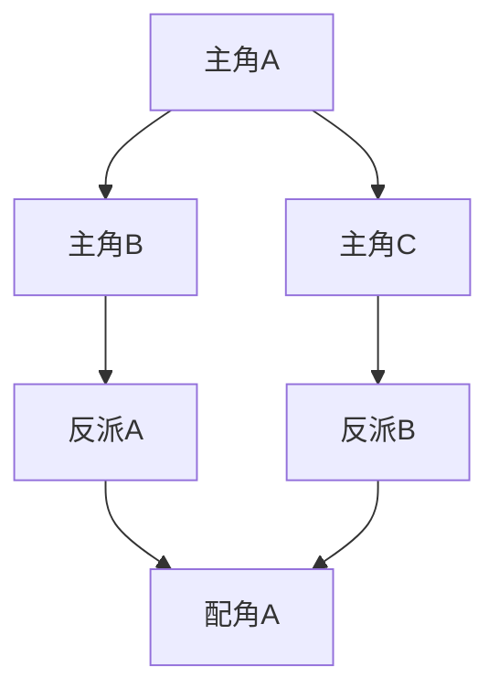

# 小说创作框架设计

> 本文档为 Seedence2 漫剧创作提供完整的小说框架结构，专注于架构设计，便于后续内容填充。

## 1. 标题系统

### 主标题
[暂定]

### 副标题
[暂定]

### 英文标题
[暂定]

### 系列名称
[暂定]

---

## 2. 世界观设定

### 基础设定
| 项目 | 内容 |
|------|------|
| 时代背景 | [古代/现代/未来/架空] |
| 地理环境 | [大陆/岛屿/宇宙/其他] |
| 社会结构 | [王朝/公司/部落/组织] |
| 科技水平 | [原始/蒸汽/电气/量子/魔法] |

### 主要势力
- **势力A**：[势力描述]
- **势力B**：[势力描述]
- **势力C**：[势力描述]
- **中立区域**：[区域描述]

### 核心冲突
[冲突类型描述]

---

## 3. 地图结构

### 世界地图

#### 主要地理特征
- **主要大陆**：[名称及描述]
- **重要城市**：[名称及功能]
- **特殊区域**：[名称及特点]
- **交通网络**：[类型及覆盖]
- **边界划分**：[政治/地理边界]

### 城市布局

#### 区域功能分配
- **核心区域**：[功能描述]
- **商业区域**：[功能描述]
- **居住区域**：[功能描述]
- **特殊建筑**：[功能描述]

---

## 4. 灵感来源

### 创作动机
[创作灵感来源描述]

### 核心主题
[主题描述]

### 目标定位
| 维度 | 内容 |
|------|------|
| 目标受众 | [受众分析] |
| 风格定位 | [风格类型] |
| 参考作品 | [借鉴来源] |
| 现实映射 | [社会意义] |

---

## 5. 角色体系

### 主角组

#### 主角A
- **角色定位**：[定位描述]
- **核心特征**：[特征描述]
- **成长轨迹**：[成长方向]

#### 主角B
- **角色定位**：[定位描述]
- **核心特征**：[特征描述]
- **成长轨迹**：[成长方向]

#### 主角C
- **角色定位**：[定位描述]
- **核心特征**：[特征描述]
- **成长轨迹**：[成长方向]

### 反派组

#### 反派A
- **角色定位**：[定位描述]
- **动机分析**：[动机描述]

#### 反派B
- **角色定位**：[定位描述]
- **动机分析**：[动机描述]

#### 反派C
- **角色定位**：[定位描述]
- **动机分析**：[动机描述]

### 配角组

#### 重要配角
- **角色定位**：[功能描述]

#### 功能配角
- **角色定位**：[功能描述]

### 角色关系网络

#### 关系发展轨迹
[关系变化描述]

---

## 6. 剧情架构

### 主线剧情

#### 故事结构
| 阶段 | 内容 | 关键事件 |
|------|------|----------|
| 开篇 | [故事起点] | [事件描述] |
| 发展 | [情节推进] | [事件描述] |
| 高潮 | [矛盾激化] | [事件描述] |
| 结局 | [故事收尾] | [事件描述] |

### 支线剧情

#### 支线A
- **主题内容**：[主题描述]
- **发展轨迹**：[情节描述]

#### 支线B
- **主题内容**：[主题描述]
- **发展轨迹**：[情节描述]

#### 支线C
- **主题内容**：[主题描述]
- **发展轨迹**：[情节描述]

### 悬念设置

#### 主要悬念
- **核心问题**：[问题描述]
- **揭晓时机**：[节点描述]

#### 次要悬念
- **辅助问题**：[问题描述]
- **揭晓时机**：[节点描述]

---

## 7. 主题内涵

### 主题层次

| 层次 | 内容 | 表现方式 |
|------|------|----------|
| 表层主题 | [直观表达] | [表现形式] |
| 深层主题 | [象征意义] | [象征手法] |
| 哲学思考 | [人生道理] | [哲学表达] |

### 社会议题映射
[现实意义描述]

### 价值观体系
[核心观念描述]

---

## 8. 风格定位

### 叙事风格
- **叙事视角**：[第一人称/第三人称/多视角]
- **语言风格**：[正式/口语/混合]
- **情感基调**：[悲喜/温馨/悬疑]
- **节奏控制**：[紧凑/舒缓/变化]

### 视觉呈现
- **画面感**：[强/中/弱]
- **描写重点**：[视觉/心理/动作]

---

## 9. 技术要素

### 叙事技巧
[技巧类型及运用]

### 结构设计
[结构模式描述]

### 叙事手法

| 手法类型 | 应用方式 | 效果目标 |
|----------|----------|----------|
| 伏笔埋设 | [埋设方式] | [效果描述] |
| 反转设计 | [反转类型] | [效果描述] |
| 高潮设计 | [高潮模式] | [效果描述] |

---

## 10. 创作规划

### 整体规划

| 阶段 | 内容 | 时间安排 |
|------|------|----------|
| 大纲完善 | [具体内容] | [时间计划] |
| 正文创作 | [具体内容] | [时间计划] |
| 修改润色 | [具体内容] | [时间计划] |

### 分卷设计
[卷数规划描述]

### 章节规划
[章节安排描述]

---

## 11. 推广策略

### 目标平台
- [发布渠道A]
- [发布渠道B]
- [发布渠道C]

### 内容营销
[营销策略描述]

### 社群运营
[粉丝管理方式]

### IP开发
[衍生规划内容]

### 商业化
[盈利模式设计]

---

## 12. 创作笔记

### 灵感记录
[随时记录的灵感]

### 素材收集
[相关资料整理]

### 人物小传
[角色背景补充]

### 世界观细节
[设定补充内容]

### 创作心得
[经验总结记录]

---

## 附录

### 参考资料
[相关参考资料列表]

### 工具推荐
[创作工具推荐]

### 联系方式
[作者联系方式]

---

**文档版本**：v1.0  
**最后更新**：2026-08-03  
**状态**：框架完成，待内容填充