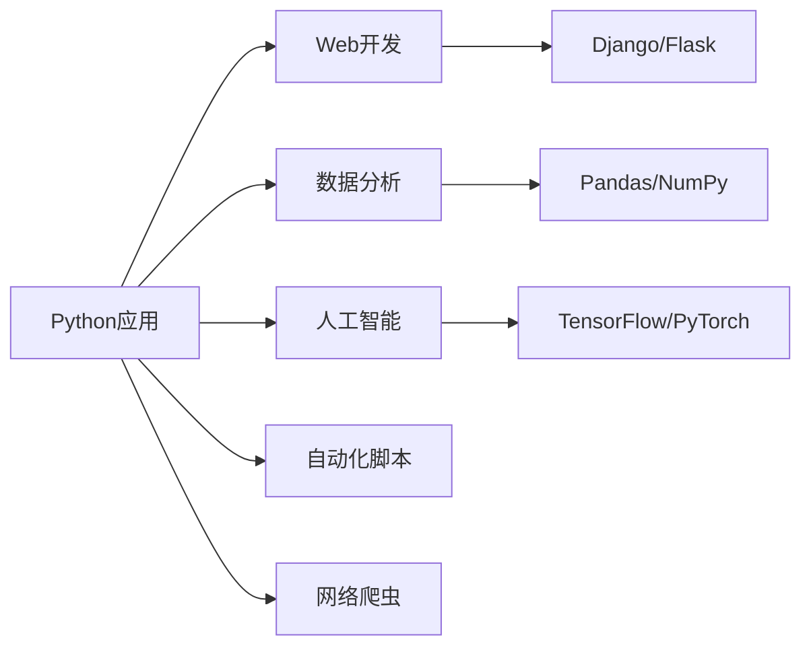

# Python入门指南（一）：基础语法与变量

> 📚 本系列文章面向Python零基础学习者，通过详细的讲解和实践练习，帮助你快速掌握Python编程技能。

## 目录

1. [Python简介](#1-python简介)
2. [环境搭建](#2-环境搭建)
3. [第一个Python程序](#3-第一个python程序)
4. [变量与数据类型](#4-变量与数据类型)
5. [运算符与表达式](#5-运算符与表达式)
6. [代码练习](#6-代码练习)
7. [小结](#7-小结)

---

## 1. Python简介

Python是一种**高级编程语言**，具有以下特点：

- ✅ **简单易学**：语法简洁，接近自然语言
- ✅ **功能强大**：可用于Web开发、数据分析、人工智能等
- ✅ **跨平台**：Windows、Mac、Linux都能运行
- ✅ **开源免费**：社区活跃，库资源丰富

### Python的应用领域



---

## 2. 环境搭建

### 2.1 安装Python

访问 [Python官网](https://www.python.org/)，下载最新版本的Python 3.x。

验证安装：

```bash
# 在终端或命令行中输入
python --version
# 或
python3 --version
```

### 2.2 IDE推荐

| IDE | 特点 | 适用人群 |
|-----|------|---------|
| **VS Code** | 轻量级、插件丰富 | 初学者 |
| **PyCharm** | 功能强大、专业 | 开发者 |
| **Jupyter Notebook** | 交互式编程 | 数据科学 |

### 2.3 第一个Python程序

创建文件 `hello.py`：

```python
#!/usr/bin/env python3
"""
这是我的第一个Python程序
"""

def main():
    # 输出欢迎信息
    print("=" * 50)
    print("🎉 欢迎来到Python的世界！")
    print("=" * 50)
    
    # 获取用户输入
    name = input("\n请输入你的名字: ")
    
    # 输出问候
    print(f"\n你好，{name}！")
    print("让我们开始Python学习之旅吧！")

if __name__ == "__main__":
    main()
```

运行结果：

```
==================================================
🎉 欢迎来到Python的世界！
==================================================

请输入你的名字: 小明

你好，小明！
让我们开始Python学习之旅吧！
```

---

## 3. 第一个Python程序

### 3.1 print() 函数

`print()` 是Python中最常用的输出函数：

```python
# 基本输出
print("Hello, World!")

# 输出数字
print(123)
print(3.14)

# 输出多个值
print("我叫", "小明", "，今年", 18, "岁")

# 使用格式化
name = "小红"
age = 20
print(f"姓名: {name}, 年龄: {age}")

# 转义字符
print("第一行\n第二行")  # 换行
print("Tab\t键")        # 制表符
print("引号: \"双引号\" 和 '单引号'")
```

### 3.2 input() 函数

`input()` 用于获取用户输入：

```python
# 基本用法
name = input("请输入你的名字: ")
print(f"你好，{name}！")

# 输入数字
age = int(input("请输入你的年龄: "))
print(f"你明年就 {age + 1} 岁了！")

# 多个输入
x, y = input("输入两个数字（用空格分隔）: ").split()
x, y = int(x), int(y)
print(f"x + y = {x + y}")
```

---

## 4. 变量与数据类型

### 4.1 变量

变量是存储数据的容器：

```python
# 变量命名规则
name = "张三"          # ✅ 正确
age = 25               # ✅ 正确
is_student = True      # ✅ 正确
city_name = "北京"     # ✅ 正确

# 2name = "李四"      # ❌ 错误：不能以数字开头
# my-name = "王五"    # ❌ 错误：不能使用连字符
# my name = "赵六"    # ❌ 错误：不能有空格
```

### 4.2 基本数据类型

```python
# 1. 整数 (int)
age = 25
year = 2026
print(f"类型: {type(age)}, 值: {age}")

# 2. 浮点数 (float)
height = 1.75
pi = 3.14159
print(f"类型: {type(height)}, 值: {height}")

# 3. 字符串 (str)
name = "小明"
message = '你好'
long_text = """这是
多行
字符串"""
print(f"类型: {type(name)}, 值: {name}")

# 4. 布尔值 (bool)
is_learning = True
is_finished = False
print(f"类型: {type(is_learning)}, 值: {is_learning}")

# 5. 空值 (NoneType)
result = None
print(f"类型: {type(result)}, 值: {result}")
```

### 4.3 数据类型转换

```python
# 字符串转整数
num_str = "100"
num_int = int(num_str)
print(f"字符串 '{num_str}' -> 整数 {num_int}")

# 整数转字符串
num = 123
num_str = str(num)
print(f"整数 {num} -> 字符串 '{num_str}'")

# 字符串转浮点数
pi_str = "3.14"
pi_float = float(pi_str)
print(f"字符串 '{pi_str}' -> 浮点数 {pi_float}")

# 转为布尔值
print(f"bool(1) = {bool(1)}")
print(f"bool(0) = {bool(0)}")
print(f"bool('非空字符串') = {bool('非空字符串')}")
print(f"bool('') = {bool('')}")
```

### 4.4 字符串操作

```python
text = "Hello, Python!"

# 长度
print(f"长度: {len(text)}")

# 索引和切片
print(f"第一个字符: {text[0]}")
print(f"最后一个字符: {text[-1]}")
print(f"前5个字符: {text[:5]}")
print(f"第7到最后: {text[7:]}")

# 大小写转换
print(f"upper(): {text.upper()}")
print(f"lower(): {text.lower()}")
print(f"title(): {text.title()}")

# 查找和替换
print(f"find('Python'): {text.find('Python')}")
print(f"replace('Python', 'World'): {text.replace('Python', 'World')}")

# 分割和连接
words = "apple,banana,orange"
print(f"split(','): {words.split(',')}")
print(f"join: {','.join(['a', 'b', 'c'])}")

# 字符串格式化
name = "张三"
age = 25
print(f"f-string: 我叫{name}，今年{age}岁")
print(f"format(): 我叫{}，今年{}岁".format(name, age))
print(f"%s/%d: 我叫%s，今年%d岁" % (name, age))
```

### 4.5 列表、元组、字典、集合

#### 列表 (List)

```python
# 创建列表
fruits = ["苹果", "香蕉", "橙子", "葡萄"]
numbers = [1, 2, 3, 4, 5]
mixed = [1, "hello", True, 3.14]

# 访问元素
print(f"第一个水果: {fruits[0]}")
print(f"最后一个水果: {fruits[-1]}")

# 修改元素
fruits[0] = "草莓"
print(f"修改后: {fruits}")

# 添加元素
fruits.append("西瓜")           # 末尾添加
fruits.insert(1, "桃子")        # 指定位置插入
print(f"添加后: {fruits}")

# 删除元素
fruits.remove("香蕉")           # 删除第一个匹配项
popped = fruits.pop()          # 删除并返回最后一个
print(f"删除'{popped}'后: {fruits}")

# 切片操作
print(f"前3个: {fruits[:3]}")
print(f"逆序: {fruits[::-1]}")

# 列表推导式
squares = [x**2 for x in range(1, 6)]
print(f"1-5的平方: {squares}")
```

#### 元组 (Tuple)

```python
# 创建元组
coordinates = (10, 20)
rgb = (255, 128, 0)

# 访问元素
print(f"x坐标: {coordinates[0]}")
print(f"y坐标: {coordinates[1]}")

# 元组不可修改，但可以包含可变对象
nested = (1, [2, 3], (4, 5))
print(f"嵌套元组: {nested}")

# 元组解包
x, y = coordinates
print(f"解包: x={x}, y={y}")

# 命名元组
from collections import namedtuple
Point = namedtuple('Point', ['x', 'y'])
p = Point(10, 20)
print(f"命名元组: x={p.x}, y={p.y}")
```

#### 字典 (Dictionary)

```python
# 创建字典
person = {
    "name": "张三",
    "age": 25,
    "city": "北京",
    "is_student": True
}

# 访问值
print(f"姓名: {person['name']}")
print(f"年龄: {person.get('age')}")
print(f"职业: {person.get('job', '未知')}")  # 提供默认值

# 添加/修改
person["email"] = "zhangsan@example.com"
person["age"] = 26
print(f"更新后: {person}")

# 删除
del person["is_student"]
job = person.pop("job", None)
print(f"删除后: {person}")

# 遍历
print("\n遍历字典:")
for key in person:
    print(f"  {key}: {person[key]}")

print("\n遍历键值对:")
for key, value in person.items():
    print(f"  {key}: {value}")

# 字典推导式
squares_dict = {x: x**2 for x in range(1, 6)}
print(f"字典推导式: {squares_dict}")
```

#### 集合 (Set)

```python
# 创建集合
fruits_set = {"苹果", "香蕉", "橙子", "苹果"}  # 自动去重
print(f"集合: {fruits_set}")
print(f"长度: {len(fruits_set)}")

# 添加/删除
fruits_set.add("葡萄")
fruits_set.remove("香蕉")  # 不存在会报错
fruits_set.discard("桃子")  # 不存在不会报错
print(f"操作后: {fruits_set}")

# 集合运算
set1 = {1, 2, 3, 4, 5}
set2 = {4, 5, 6, 7, 8}

print(f"并集: {set1 | set2}")
print(f"交集: {set1 & set2}")
print(f"差集: {set1 - set2}")
print(f"对称差集: {set1 ^ set2}")

# 子集和超集
a = {1, 2, 3}
b = {1, 2, 3, 4, 5}
print(f"a是b的子集: {a.issubset(b)}")
print(f"b是a的超集: {b.issuperset(a)}")
```

---

## 5. 运算符与表达式

### 5.1 算术运算符

```python
a, b = 10, 3

print(f"加法: {a} + {b} = {a + b}")
print(f"减法: {a} - {b} = {a - b}")
print(f"乘法: {a} * {b} = {a * b}")
print(f"除法: {a} / {b} = {a / b}")
print(f"整除: {a} // {b} = {a // b}")
print(f"取余: {a} % {b} = {a % b}")
print(f"幂运算: {a} ** {b} = {a ** b}")
```

### 5.2 比较运算符

```python
x, y = 5, 10

print(f"{x} == {y}: {x == y}")  # False
print(f"{x} != {y}: {x != y}")  # True
print(f"{x} < {y}: {x < y}")    # True
print(f"{x} > {y}: {x > y}")    # False
print(f"{x} <= {y}: {x <= y}")  # True
print(f"{x} >= {y}: {x >= y}")  # False
```

### 5.3 逻辑运算符

```python
a, b = True, False

print(f"and: {a} and {b} = {a and b}")
print(f"or: {a} or {b} = {a or b}")
print(f"not {a} = {not a}")

# 短路运算
name = ""
result = name and "有值" or "无值"
print(f"短路运算: {result}")
```

---

## 6. 代码练习

### 练习1：计算器

📝 **要求**：创建一个简单的计算器程序

```python
def calculator():
    """简单的四则运算计算器"""
    print("🧮 简易计算器")
    print("=" * 30)
    
    num1 = float(input("请输入第一个数字: "))
    operator = input("请输入运算符 (+, -, *, /): ")
    num2 = float(input("请输入第二个数字: "))
    
    if operator == '+':
        result = num1 + num2
    elif operator == '-':
        result = num1 - num2
    elif operator == '*':
        result = num1 * num2
    elif operator == '/':
        if num2 != 0:
            result = num1 / num2
        else:
            print("❌ 错误：除数不能为零！")
            return
    else:
        print("❌ 错误：无效的运算符！")
        return
    
    print(f"\n✅ 结果: {num1} {operator} {num2} = {result}")

calculator()
```

### 练习2：温度转换器

📝 **要求**：实现摄氏度与华氏度的互相转换

```python
def temperature_converter():
    """温度转换器"""
    print("🌡️ 温度转换器")
    print("1. 摄氏度 -> 华氏度")
    print("2. 华氏度 -> 摄氏度")
    
    choice = input("请选择 (1/2): ")
    temp = float(input("请输入温度值: "))
    
    if choice == '1':
        fahrenheit = (temp * 9/5) + 32
        print(f"\n🌡️ {temp}°C = {fahrenheit:.2f}°F")
    elif choice == '2':
        celsius = (temp - 32) * 5/9
        print(f"\n🌡️ {temp}°F = {celsius:.2f}°C")
    else:
        print("❌ 无效选择！")

temperature_converter()
```

### 练习3：成绩评级系统

📝 **要求**：根据分数输出等级

```python
def grade_system():
    """成绩评级系统"""
    score = float(input("请输入分数 (0-100): "))
    
    if score < 0 or score > 100:
        print("❌ 分数无效！")
        return
    
    if score >= 90:
        grade = "A"
        description = "优秀"
    elif score >= 80:
        grade = "B"
        description = "良好"
    elif score >= 70:
        grade = "C"
        description = "中等"
    elif score >= 60:
        grade = "D"
        description = "及格"
    else:
        grade = "F"
        description = "不及格"
    
    print(f"\n📊 成绩评级")
    print(f"分数: {score}")
    print(f"等级: {grade}")
    print(f"评价: {description}")

grade_system()
```

---

## 7. 小结

### 📚 本章知识点

| 知识点 | 说明 |
|--------|------|
| **print()** | 输出函数 |
| **input()** | 输入函数 |
| **变量** | 存储数据的容器 |
| **数据类型** | int, float, str, bool, None |
| **字符串** | 索引、切片、格式化 |
| **列表** | 有序、可变序列 |
| **元组** | 有序、不可变序列 |
| **字典** | 键值对集合 |
| **集合** | 无序、不重复 |
| **运算符** | 算术、比较、逻辑 |

### 🎯 练习题

1. **基础题**：编写程序交换两个变量的值
2. **进阶题**：实现一个BMI计算器（BMI = 体重 / 身高²）
3. **挑战题**：创建一个猜数字游戏

### 📖 下节预告

下一篇文章我们将学习：
- 🔄 条件语句 (if/elif/else)
- 🔁 循环语句 (for/while)
- 📦 函数的定义和调用
- 🔧 参数传递和返回值

---

## 💬 讨论与反馈

如果你在学习过程中有任何问题，欢迎在评论区留言！

### 🔗 相关资源

- [Python官方文档](https://docs.python.org/3/)
- [Python教程 - 廖雪峰](https://www.liaoxuefeng.com/wiki/1016959663602400)
- [VS Code Python配置指南](https://code.visualstudio.com/docs/python/python-tutorial)

---

**📅 文章信息**：
- 作者：你的名字
- 发表日期：2026-08-06
- 更新日期：2026-08-06
- 阅读量：0

**🏷️ 标签**：`Python` `编程入门` `基础语法`