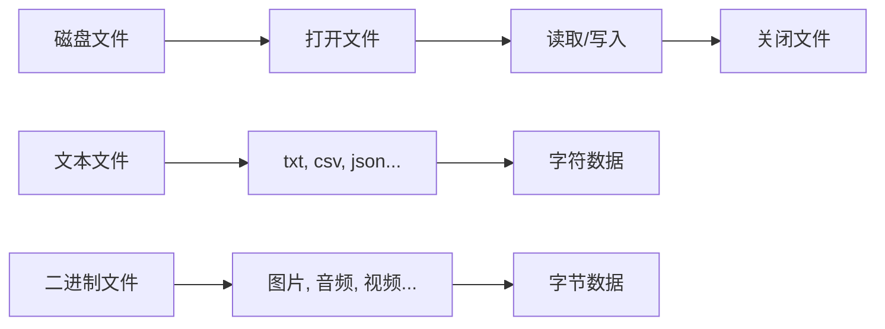

# Python入门指南（三）：文件操作与异常处理

> 📚 本系列文章面向Python零基础学习者，本节内容涵盖文件操作、目录管理和异常处理。

## 目录

1. [文件操作简介](#1-文件操作简介)
2. [打开和关闭文件](#2-打开和关闭文件)
3. [读取文件](#3-读取文件)
4. [写入文件](#4-写入文件)
5. [文件指针与追加](#5-文件指针与追加)
6. [with语句与上下文管理器](#6-with语句与上下文管理器)
7. [目录操作](#7-目录操作)
8. [异常处理](#8-异常处理)
9. [自定义异常](#9-自定义异常)
10. [实战项目](#10-实战项目)
11. [小结](#11-小结)

---

## 1. 文件操作简介

### 1.1 为什么需要文件操作？

- 💾 **数据持久化**：程序关闭后数据不丢失
- 📊 **数据存储**：保存配置、用户数据等
- 📝 **日志记录**：记录程序运行信息
- 📂 **配置文件**：存储程序设置

### 1.2 文件的基本概念



### 1.3 文件路径

```python
import os

# 不同操作系统的路径分隔符
print(f"Linux/Mac: {os.path.sep}")  # /
print(f"Windows: 反斜杠")

# 路径操作
file_path = "documents/data/sample.txt"

# 获取路径的各个部分
print(f"文件名: {os.path.basename(file_path)}")
print(f"目录: {os.path.dirname(file_path)}")
print(f"扩展名: {os.path.splitext(file_path)[1]}")

# 判断文件是否存在
print(f"文件存在: {os.path.exists(file_path)}")
print(f"是文件: {os.path.isfile(file_path)}")
print(f"是目录: {os.path.isdir('documents')}")
```

---

## 2. 打开和关闭文件

### 2.1 open()函数

```python
# 基本语法
file = open(filename, mode, encoding)

# 参数说明:
# filename: 文件名
# mode: 打开模式
# encoding: 编码方式（通常使用utf-8）
```

### 2.2 打开模式

| 模式 | 说明 | 文件指针位置 | 文件不存在 |
|------|------|-------------|-----------|
| `r` | 只读 | 文件开头 | 报错 |
| `w` | 只写 | 文件开头 | 创建新文件 |
| `a` | 追加 | 文件末尾 | 创建新文件 |
| `x` | 创建并写入 | 文件开头 | 创建新文件 |
| `r+` | 读写 | 文件开头 | 报错 |
| `w+` | 读写 | 文件开头 | 创建新文件 |
| `a+` | 读和追加 | 文件末尾 | 创建新文件 |

### 2.3 文件的打开和关闭

```python
# ❌ 不推荐的写法（忘记关闭文件）
file = open("test.txt", "w")
file.write("Hello")
file.close()  # 如果这之前出错，文件不会关闭

# ✅ 使用close()确保关闭
try:
    file = open("test.txt", "w", encoding="utf-8")
    file.write("Hello, Python!")
except Exception as e:
    print(f"错误: {e}")
finally:
    file.close()
    print("文件已关闭")
```

---

## 3. 读取文件

### 3.1 读取全部内容

```python
# 读取全部内容（返回字符串）
file = open("sample.txt", "r", encoding="utf-8")
content = file.read()
print(content)
file.close()

# 读取全部行（返回列表）
file = open("sample.txt", "r", encoding="utf-8")
lines = file.readlines()
for i, line in enumerate(lines, 1):
    print(f"{i}: {line.strip()}")
file.close()
```

### 3.2 按行读取

```python
# 方法1：逐行读取
file = open("sample.txt", "r", encoding="utf-8")

line = file.readline()
while line:
    print(line.strip())
    line = file.readline()

file.close()

# 方法2：使用for循环（推荐）
file = open("sample.txt", "r", encoding="utf-8")

for line in file:
    print(line.strip())

file.close()
```

### 3.3 读取指定字符数

```python
file = open("sample.txt", "r", encoding="utf-8")

# 读取前10个字符
content = file.read(10)
print(f"前10个字符: {content}")

# 继续读取接下来的10个字符
content = file.read(10)
print(f"接下来的10个字符: {content}")

file.close()
```

### 3.4 实用读取示例

```python
def read_file_with_line_numbers(filename):
    """带行号读取文件"""
    try:
        with open(filename, "r", encoding="utf-8") as file:
            for i, line in enumerate(file, 1):
                print(f"{i:3d}: {line.rstrip()}")
    except FileNotFoundError:
        print(f"❌ 文件不存在: {filename}")
    except Exception as e:
        print(f"❌ 读取错误: {e}")

# 读取CSV文件
def read_csv(filename):
    """简单的CSV读取"""
    with open(filename, "r", encoding="utf-8") as file:
        for line in file:
            # 去除换行符，按逗号分割
            fields = line.strip().split(",")
            print(f"字段: {fields}")

# 读取JSON文件
import json

def read_json(filename):
    """读取JSON文件"""
    with open(filename, "r", encoding="utf-8") as file:
        data = json.load(file)
        return data
```

---

## 4. 写入文件

### 4.1 基本写入

```python
# 写入字符串
file = open("output.txt", "w", encoding="utf-8")
file.write("第一行\n")
file.write("第二行\n")
file.write("第三行")
file.close()

print("✅ 写入完成！")
```

### 4.2 writelines()方法

```python
# 一次写入多行
lines = [
    "第一行内容\n",
    "第二行内容\n",
    "第三行内容\n"
]

file = open("output.txt", "w", encoding="utf-8")
file.writelines(lines)
file.close()

print("✅ 多行写入完成！")
```

### 4.3 写入示例

```python
def save_data_to_file(filename, data):
    """保存数据到文件"""
    with open(filename, "w", encoding="utf-8") as file:
        file.write("=" * 50 + "\n")
        file.write("数据报告\n")
        file.write("=" * 50 + "\n\n")
        
        for key, value in data.items():
            file.write(f"{key}: {value}\n")
        
        file.write("\n" + "=" * 50 + "\n")
    
    print(f"✅ 数据已保存到: {filename}")

# 使用示例
data = {
    "用户名": "张三",
    "年龄": "25",
    "城市": "北京",
    "职业": "工程师"
}

save_data_to_file("report.txt", data)
```

---

## 5. 文件指针与追加

### 5.1 tell()方法 - 获取指针位置

```python
file = open("sample.txt", "r", encoding="utf-8")

# 读取前5个字符
content = file.read(5)
position = file.tell()
print(f"已读取: '{content}'")
print(f"当前指针位置: {position}")

file.close()
```

### 5.2 seek()方法 - 移动指针

```python
# seek(offset, whence)
# offset: 偏移量
# whence: 0=文件开头, 1=当前位置, 2=文件末尾

file = open("sample.txt", "r", encoding="utf-8")

# 移动到文件开头
file.seek(0)
print(f"开头: {file.read(5)}")

# 移动到第10个字符
file.seek(10)
print(f"第10个字符: {file.read(5)}")

# 从文件末尾往前移动10个字符
file.seek(-10, 2)
print(f"末尾10字符: {file.read(10)}")

file.close()
```

### 5.3 追加模式

```python
# 使用追加模式 'a'
file = open("log.txt", "a", encoding="utf-8")

# 添加日志
import datetime

timestamp = datetime.datetime.now().strftime("%Y-%m-%d %H:%M:%S")
file.write(f"[{timestamp}] 用户登录\n")
file.write(f"[{timestamp}] 用户浏览页面\n")
file.write(f"[{timestamp}] 用户退出\n")

file.close()

print("✅ 日志已追加！")
```

---

## 6. with语句与上下文管理器

### 6.1 为什么使用with？

```python
# ❌ 传统方式需要手动关闭
file = open("test.txt", "r")
try:
    content = file.read()
    print(content)
finally:
    file.close()

# ✅ 使用with自动关闭（推荐）
with open("test.txt", "r") as file:
    content = file.read()
    print(content)
# 文件自动关闭，无需手动处理
```

### 6.2 with的原理

```python
# with语句等价于:
file = open("test.txt", "r")
try:
    content = file.read()
finally:
    file.close()  # 即使出错也会关闭文件
```

### 6.3 读写组合示例

```python
def copy_file(source_file, dest_file):
    """复制文件"""
    with open(source_file, "r", encoding="utf-8") as src:
        with open(dest_file, "w", encoding="utf-8") as dst:
            content = src.read()
            dst.write(content)
    
    print(f"✅ 文件已复制: {source_file} -> {dest_file}")

def merge_files(file_list, output_file):
    """合并多个文件"""
    with open(output_file, "w", encoding="utf-8") as out:
        for i, filename in enumerate(file_list, 1):
            with open(filename, "r", encoding="utf-8") as infile:
                out.write(f"=== 文件{i}: {filename} ===\n")
                out.write(infile.read())
                out.write("\n\n")
    
    print(f"✅ 已合并{len(file_list)}个文件到: {output_file}")
```

---

## 7. 目录操作

### 7.1 os模块

```python
import os

# 当前工作目录
print(f"当前目录: {os.getcwd()}")

# 创建目录
os.mkdir("new_folder")

# 创建多层目录
os.makedirs("parent/child/grandchild")

# 删除目录
os.rmdir("empty_folder")

# 删除文件和目录
os.remove("file.txt")
os.rmdir("folder")

# 重命名
os.rename("old_name.txt", "new_name.txt")

# 列出目录内容
files = os.listdir(".")
print(f"当前目录文件: {files}")

# 判断文件/目录是否存在
print(f"exists: {os.path.exists('test.txt')}")
print(f"isfile: {os.path.isfile('test.txt')}")
print(f"isdir: {os.path.isdir('folder')}")
```

### 7.2 pathlib模块（现代方式）

```python
from pathlib import Path

# 创建Path对象
p = Path("documents/data/sample.txt")

# 基本操作
print(f"文件名: {p.name}")
print(f"文件扩展名: {p.suffix}")
print(f"父目录: {p.parent}")
print(f"路径: {p}")

# 创建目录
(Path("new_folder")).mkdir(parents=True, exist_ok=True)

# 遍历目录
for item in Path(".").iterdir():
    if item.is_file():
        print(f"📄 {item.name}")
    elif item.is_dir():
        print(f"📁 {item.name}/")

# 递归遍历
for item in Path(".").rglob("*.py"):  # 所有.py文件
    print(f"Python文件: {item}")

# 文件读写（简洁方式）
Path("test.txt").write_text("Hello, World!", encoding="utf-8")
content = Path("test.txt").read_text(encoding="utf-8")
print(content)
```

---

## 8. 异常处理

### 8.1 什么是异常？

```python
# 常见的异常类型
print("常见的异常类型:")
print("-" * 40)

exceptions = [
    ("ZeroDivisionError", "除数为零"),
    ("FileNotFoundError", "文件不存在"),
    ("TypeError", "类型错误"),
    ("ValueError", "值错误"),
    ("KeyError", "字典键不存在"),
    ("IndexError", "索引超出范围"),
    ("AttributeError", "属性不存在"),
    ("NameError", "变量名不存在")
]

for exc_type, description in exceptions:
    print(f"{exc_type:20s} - {description}")
```

### 8.2 try-except基本语法

```python
# 捕获特定异常
try:
    result = 10 / 0
except ZeroDivisionError:
    print("❌ 除数不能为零！")

# 捕获多个异常
try:
    num = int(input("请输入数字: "))
    result = 10 / num
except ValueError:
    print("❌ 请输入有效的数字！")
except ZeroDivisionError:
    print("❌ 除数不能为零！")

# 捕获所有异常
try:
    result = 10 / 0
except Exception as e:
    print(f"❌ 发生错误: {e}")
    print(f"错误类型: {type(e).__name__}")
```

### 8.3 完整的异常处理结构

```python
try:
    # 尝试执行的代码
    file = open("test.txt", "r")
    content = file.read()
    number = int(input("输入数字: "))
    result = 10 / number

except FileNotFoundError:
    # 文件不存在
    print("❌ 文件不存在！")
    
except ValueError:
    # 值转换错误
    print("❌ 请输入有效的数字！")
    
except ZeroDivisionError:
    # 除数为零
    print("❌ 除数不能为零！")
    
except Exception as e:
    # 其他所有错误
    print(f"❌ 发生未知错误: {e}")
    
else:
    # 如果没有发生异常（可选）
    print("✅ 操作成功完成！")
    print(f"结果是: {result}")
    
finally:
    # 无论是否出错都会执行（可选）
    print("📝 清理工作...")
    if 'file' in locals():
        file.close()
```

### 8.4 异常处理示例

```python
def safe_divide(a, b):
    """安全的除法运算"""
    try:
        result = a / b
        return result
    except ZeroDivisionError:
        print("❌ 错误：除数不能为零！")
        return None
    except (TypeError, ValueError):
        print("❌ 错误：请输入有效的数字！")
        return None

def read_config(filename):
    """读取配置文件（带异常处理）"""
    try:
        with open(filename, "r", encoding="utf-8") as file:
            config = {}
            for line in file:
                line = line.strip()
                if line and not line.startswith("#"):
                    if "=" in line:
                        key, value = line.split("=", 1)
                        config[key.strip()] = value.strip()
            return config
    except FileNotFoundError:
        print(f"❌ 配置文件不存在: {filename}")
        return {}
    except PermissionError:
        print(f"❌ 没有读取权限: {filename}")
        return {}
    except Exception as e:
        print(f"❌ 读取配置文件时出错: {e}")
        return {}
```

---

## 9. 自定义异常

### 9.1 创建自定义异常

```python
class ValidationError(Exception):
    """数据验证错误"""
    def __init__(self, message, field=None):
        self.message = message
        self.field = field
        super().__init__(self.message)
    
    def __str__(self):
        if self.field:
            return f"验证错误 [{self.field}]: {self.message}"
        return f"验证错误: {self.message}"

class AgeError(ValidationError):
    """年龄错误"""
    def __init__(self, age, message="年龄不在有效范围内"):
        self.age = age
        super().__init__(message, field="age")
    
    def __str__(self):
        return f"年龄错误: {self.age}岁 - {self.message}"
```

### 9.2 使用自定义异常

```python
def validate_user(name, age, email):
    """验证用户信息"""
    errors = []
    
    # 验证姓名
    if not name or len(name) < 2:
        errors.append(ValidationError("姓名至少需要2个字符", "name"))
    
    # 验证年龄
    if not isinstance(age, int) or age < 0 or age > 150:
        errors.append(AgeError(age))
    
    # 验证邮箱
    if "@" not in email:
        errors.append(ValidationError("邮箱格式不正确", "email"))
    
    if errors:
        for error in errors:
            print(f"❌ {error}")
        return False
    
    return True

# 测试
if validate_user("张", 25, "zhangsan@example.com"):
    print("✅ 验证通过！")
```

---

## 10. 实战项目

### 项目1：简单的记事本

```python
from pathlib import Path

class NoteApp:
    """简单的记事本应用"""
    
    def __init__(self, filename="notes.txt"):
        self.filename = filename
        self.notes = []
        self.load_notes()
    
    def load_notes(self):
        """加载笔记"""
        if Path(self.filename).exists():
            try:
                with open(self.filename, "r", encoding="utf-8") as f:
                    self.notes = [line.strip() for line in f if line.strip()]
                print(f"✅ 已加载 {len(self.notes)} 条笔记")
            except Exception as e:
                print(f"❌ 加载失败: {e}")
                self.notes = []
    
    def save_notes(self):
        """保存笔记"""
        try:
            with open(self.filename, "w", encoding="utf-8") as f:
                for note in self.notes:
                    f.write(note + "\n")
            print(f"✅ 已保存 {len(self.notes)} 条笔记")
        except Exception as e:
            print(f"❌ 保存失败: {e}")
    
    def add_note(self, content):
        """添加笔记"""
        self.notes.append(content)
        self.save_notes()
        print("✅ 笔记已添加！")
    
    def delete_note(self, index):
        """删除笔记"""
        try:
            removed = self.notes.pop(index - 1)
            self.save_notes()
            print(f"✅ 已删除: {removed}")
        except IndexError:
            print("❌ 笔记编号不存在！")
    
    def show_notes(self):
        """显示所有笔记"""
        if not self.notes:
            print("📝 暂无笔记")
            return
        
        print("\n📒 笔记列表:")
        print("-" * 50)
        for i, note in enumerate(self.notes, 1):
            print(f"{i}. {note}")
    
    def menu(self):
        """显示菜单"""
        print("\n" + "=" * 50)
        print("📝 简单记事本")
        print("=" * 50)
        print("1. 查看所有笔记")
        print("2. 添加笔记")
        print("3. 删除笔记")
        print("4. 退出")
        print("=" * 50)

# 使用记事本
def main():
    app = NoteApp()
    
    while True:
        app.menu()
        choice = input("请选择 (1-4): ")
        
        if choice == "1":
            app.show_notes()
        elif choice == "2":
            content = input("请输入笔记内容: ")
            app.add_note(content)
        elif choice == "3":
            app.show_notes()
            try:
                index = int(input("请输入要删除的笔记编号: "))
                app.delete_note(index)
            except ValueError:
                print("❌ 请输入有效的编号！")
        elif choice == "4":
            print("👋 再见！")
            break
        else:
            print("❌ 无效选择！")

if __name__ == "__main__":
    main()
```

### 项目2：日志系统

```python
import datetime
from pathlib import Path

class Logger:
    """简单的日志系统"""
    
    def __init__(self, filename="app.log"):
        self.filename = filename
        self.levels = {
            "DEBUG": "🔍",
            "INFO": "ℹ️",
            "WARNING": "⚠️",
            "ERROR": "❌",
            "CRITICAL": "🔴"
        }
    
    def log(self, message, level="INFO"):
        """记录日志"""
        if level not in self.levels:
            level = "INFO"
        
        timestamp = datetime.datetime.now().strftime("%Y-%m-%d %H:%M:%S")
        icon = self.levels[level]
        log_entry = f"[{timestamp}] {icon} [{level}] {message}\n"
        
        try:
            with open(self.filename, "a", encoding="utf-8") as f:
                f.write(log_entry)
        except Exception as e:
            print(f"❌ 写入日志失败: {e}")
        
        print(log_entry.strip())
    
    def read_logs(self, lines=10):
        """读取最近N条日志"""
        try:
            with open(self.filename, "r", encoding="utf-8") as f:
                all_lines = f.readlines()
                recent = all_lines[-lines:] if len(all_lines) > lines else all_lines
                
                print(f"\n📋 最近{len(recent)}条日志:")
                print("-" * 60)
                for line in recent:
                    print(line.strip())
        except FileNotFoundError:
            print("❌ 日志文件不存在！")
        except Exception as e:
            print(f"❌ 读取日志失败: {e}")

# 使用日志系统
logger = Logger()

logger.log("程序启动", "INFO")
logger.log("加载配置文件", "DEBUG")
logger.log("连接数据库", "INFO")
logger.log("数据库连接失败", "ERROR")
logger.log("系统资源不足", "WARNING")

logger.read_logs()
```

---

## 11. 小结

### 📚 本章知识点

| 知识点 | 说明 |
|--------|------|
| **open()** | 打开文件 |
| **文件模式** | r/w/a/x/+ 等 |
| **read()** | 读取文件 |
| **write()** | 写入文件 |
| **with语句** | 自动关闭文件 |
| **pathlib** | 现代路径操作 |
| **try-except** | 异常捕获 |
| **finally** | 清理代码 |
| **自定义异常** | 创建特定异常类型 |

### 🎯 下节预告

下一篇文章我们将学习：
- 📦 模块和包
- 🔧 常用标准库
- 🛠️ pip包管理
- 📚 第三方库使用

### 📖 相关资源

- [Python官方文档 - 文件IO](https://docs.python.org/3/tutorial/inputoutput.html#reading-and-writing-files)
- [Python官方文档 - 错误和异常](https://docs.python.org/3/tutorial/errors.html)

---

**📅 文章信息**：
- 作者：你的名字
- 发表日期：2026-08-08
- 阅读量：0

**🏷️ 标签**：`Python` `文件操作` `异常处理` `IO操作`