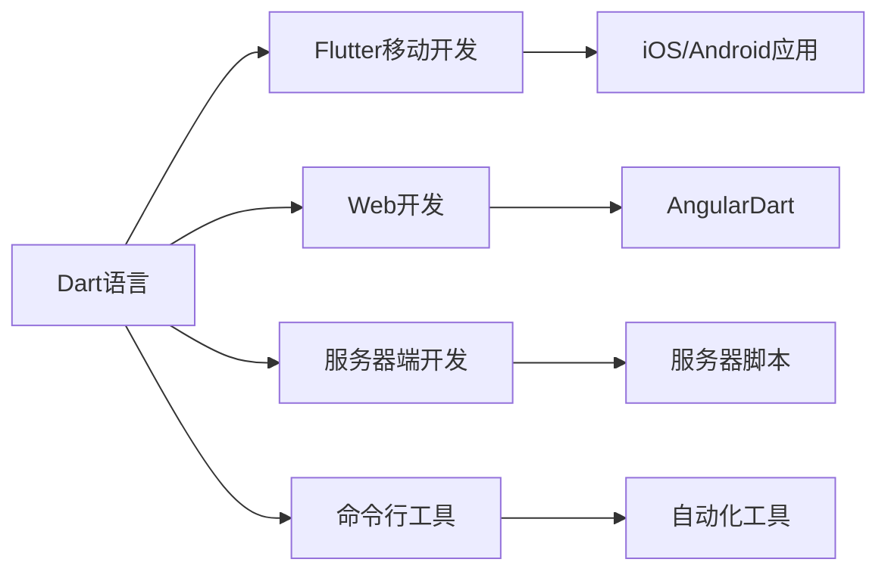

# Dart入门指南（一）：基础语法与数据类型

> 📚 本系列文章面向Dart零基础学习者，通过详细的讲解和实践练习，帮助你快速掌握Dart编程技能，为Flutter开发打下坚实基础。

## 目录

1. [Dart简介](#1-dart简介)
2. [环境搭建](#2-环境搭建)
3. [变量声明](#3-变量声明)
4. [数据类型](#4-数据类型)
5. [运算符](#5-运算符)
6. [控制流程](#6-控制流程)
7. [函数](#7-函数)
8. [小结](#8-小结)

---

## 1. Dart简介

### 什么是Dart？

Dart是由Google开发的**现代化编程语言**，主要特点：

- ✅ **语法简洁**：易于学习和阅读
- ✅ **类型安全**：编译时检查，减少运行时错误
- ✅ **面向对象**：支持类、接口、继承等特性
- ✅ **跨平台**：支持Web、移动端、桌面端
- ✅ **性能优秀**：支持AOT和JIT编译

### Dart的主要应用场景



---

## 2. 环境搭建

### 2.1 安装Dart SDK

**macOS (使用Homebrew):**
```bash
brew install dart
```

**Windows (使用Chocolatey):**
```powershell
choco install dart-sdk
```

**Linux (使用apt):**
```bash
apt-get install dart
```

### 2.2 验证安装

```bash
dart --version
# 输出: Dart SDK version: 3.x.x
```

### 2.3 创建项目

```bash
# 创建新项目
dart create my_app

# 进入目录
cd my_app

# 运行
dart run
```

---

## 3. 变量声明

### 3.1 var 声明（类型推断）

```dart
void main() {
  // Dart会自动推断变量类型
  var name = '小明';      // 推断为 String
  var age = 25;          // 推断为 int
  var height = 1.75;     // 推断为 double
  var isStudent = true;  // 推断为 bool

  print('$name, $age岁, ${height}m, 学生: $isStudent');
}
```

### 3.2 明确类型声明

```dart
void main() {
  // 明确指定类型
  String name = '小红';
  int age = 22;
  double height = 1.65;
  bool isWorking = false;

  print('$name, $age岁, ${height}m, 在职: $isWorking');
}
```

### 3.3 final 和 const

```dart
void main() {
  // final：运行时常量，只能赋值一次
  final String name = '小明';
  // name = '小红';  // ❌ 错误：final变量不能重新赋值

  // const：编译时常量
  const int MAX_COUNT = 100;
  // MAX_COUNT = 90;  // ❌ 错误：const变量不能重新赋值

  // 区别：const必须是编译时可确定的常量
  final now = DateTime.now();  // ✅ 可以，运行时确定
  // const now2 = DateTime.now();  // ❌ 错误，编译时无法确定

  // final 列表可以修改内容，但不能重新赋值
  final List<String> fruits = ['苹果', '香蕉'];
  fruits.add('橙子');  // ✅ 可以修改内容
  // fruits = ['葡萄'];  // ❌ 不能重新赋值

  // const 列表内容也不能修改
  const List<String> colors = ['红色', '绿色'];
  // colors.add('蓝色');  // ❌ 错误
}
```

### 3.4 dynamic 和 Object

```dart
void main() {
  // dynamic：动态类型，可以存储任何类型
  dynamic value = '字符串';
  value = 123;           // 可以赋值为int
  value = true;          // 可以赋值为bool
  value = [1, 2, 3];     // 可以赋值为List

  // Object：所有类型的基类
  Object obj = '字符串';
  obj = 456;

  // 两者区别：dynamic不进行类型检查
  dynamic dyn = 'hello';
  print(dyn.length);  // ✅ 编译时不报错，运行时才检查

  // 建议：尽量使用明确类型
}
```

---

## 4. 数据类型

### 4.1 字符串 (String)

```dart
void main() {
  // 基本字符串
  String s1 = '单引号字符串';
  String s2 = "双引号字符串";

  // 多行字符串
  String multiline = '''
    第一行
    第二行
    第三行
  ''';

  // 原始字符串（不转义）
  String path = r'C:\Users\test\file.txt';

  // 字符串插值
  String name = '小明';
  int age = 25;
  print('你好，$name！你$age岁了');  // 你好，小明！你25岁了
  print('计算结果: ${5 + 3}');        // 计算结果: 8

  // 常用方法
  String text = 'Hello, Dart!';
  print(text.toUpperCase());      // HELLO, DART!
  print(text.toLowerCase());      // hello, dart!
  print(text.length);             // 13
  print(text.contains('Dart'));   // true
  print(text.substring(0, 5));    // Hello
  print(text.split(', '));        // [Hello, Dart!]
  print(text.replaceAll('Dart', 'Flutter'));  // Hello, Flutter!

  // 字符串拼接
  String s = 'Hello' + ' ' + 'World';  // Hello World
  String s2 = ['Hello', 'World'].join(' ');  // Hello World
}
```

### 4.2 数字 (int, double, num)

```dart
void main() {
  // int：整数
  int count = 42;
  int hex = 0xFF;  // 十六进制：255
  int binary = 0b1010;  // 二进制：10

  // double：浮点数
  double pi = 3.14159;
  double scientific = 1.5e10;  // 科学计数法：15000000000.0

  // num：int或double的父类型
  num num1 = 10;    // 可以是int
  num num2 = 3.14;  // 也可以是double

  // 类型转换
  int i = int.parse('42');           // String -> int
  double d = double.parse('3.14');   // String -> double
  String s1 = 42.toString();         // int -> String
  String s2 = 3.14159.toStringAsFixed(2);  // 保留2位小数 -> "3.14"

  // 取整方法
  double x = 3.7;
  print(x.floor());      // 3  向下取整
  print(x.ceil());       // 4  向上取整
  print(x.round());      // 4  四舍五入
  print(x.truncate());   // 3  截断小数

  // 数学运算
  print((-5).abs());           // 5  绝对值
  print((5).clamp(0, 10));     // 5  限制范围
  print(2.toString());         // "2"
  print(2.5.toInt());          // 2
}
```

### 4.3 布尔值 (bool)

```dart
void main() {
  bool isActive = true;
  bool isEmpty = false;

  // 条件判断
  if (isActive) {
    print('✅ 系统已激活');
  } else {
    print('❌ 系统未激活');
  }

  // 三元运算符
  String status = isActive ? '在线' : '离线';
  print('状态: $status');

  // ?? 运算符（null合并）
  String? name;
  String displayName = name ?? '匿名用户';
  print('显示名称: $displayName');  // 匿名用户

  // ??= 赋值运算符
  String? title;
  title ??= '默认标题';
  print('标题: $title');  // 默认标题
}
```

### 4.4 列表 (List)

```dart
void main() {
  // 创建列表
  List<String> fruits = ['苹果', '香蕉', '橙子'];

  // 字面量（类型推断）
  var numbers = [1, 2, 3, 4, 5];

  // 访问元素
  print(fruits[0]);      // 苹果
  print(fruits.first);   // 苹果
  print(fruits.last);    // 橙子
  print(fruits.length);  // 3

  // 修改元素
  fruits[0] = '草莓';
  fruits.add('葡萄');        // 末尾添加
  fruits.insert(1, '桃子');  // 指定位置插入
  fruits.remove('香蕉');     // 删除第一个匹配项
  fruits.removeAt(0);        // 删除指定位置

  // 遍历
  for (var fruit in fruits) {
    print('* $fruit');
  }

  // 带索引遍历
  for (var i = 0; i < fruits.length; i++) {
    print('$i: ${fruits[i]}');
  }

  // 列表方法
  var nums = [3, 1, 4, 1, 5, 9, 2, 6];
  nums.sort();  // 排序
  print(nums);  // [1, 1, 2, 3, 4, 5, 6, 9]

  // map, where, reduce
  var doubled = nums.map((n) => n * 2).toList();
  print('平方: $doubled');  // [2, 2, 4, 6, 8, 10, 12, 18]

  var filtered = nums.where((n) => n > 3).toList();
  print('大于3: $filtered');  // [4, 5, 6, 9]

  var sum = nums.reduce((a, b) => a + b);
  print('总和: $sum');  // 31
}
```

### 4.5 集合 (Set)

```dart
void main() {
  // 创建集合（自动去重）
  Set<String> colors = {'红色', '绿色', '蓝色', '红色'};
  print(colors);  // {红色, 绿色, 蓝色} 只有一个'红色'

  // 添加/删除
  colors.add('黄色');
  colors.addAll(['紫色', '橙色']);
  colors.remove('绿色');
  print(colors.length);  // 5

  // 判断
  print(colors.contains('蓝色'));  // true

  // 集合运算
  Set<int> setA = {1, 2, 3, 4, 5};
  Set<int> setB = {4, 5, 6, 7, 8};

  print('并集: ${setA.union(setB)}');           // {1, 2, 3, 4, 5, 6, 7, 8}
  print('交集: ${setA.intersection(setB)}');    // {4, 5}
  print('差集(A-B): ${setA.difference(setB)}'); // {1, 2, 3}
  print('对称差集: ${setA.symmetricDifference(setB)}');  // {1, 2, 3, 6, 7, 8}
}
```

### 4.6 映射 (Map)

```dart
void main() {
  // 创建映射
  Map<String, int> scores = {
    '语文': 90,
    '数学': 95,
    '英语': 88,
  };

  // 访问
  print(scores['语文']);      // 90
  print(scores['物理']);      // null（不存在）

  // 添加/修改
  scores['化学'] = 92;
  scores['数学'] = 98;
  scores.putIfAbsent('生物', () => 85);  // 不存在才添加

  // 删除
  scores.remove('英语');
  // scores.clear();  // 清空

  // 遍历
  scores.forEach((key, value) {
    print('$key: $value');
  });

  // 常用方法
  print(scores.keys);                // (语文, 数学, 化学, 生物)
  print(scores.values);              // (90, 98, 92, 85)
  print(scores.containsKey('语文')); // true
  print(scores.containsValue(95