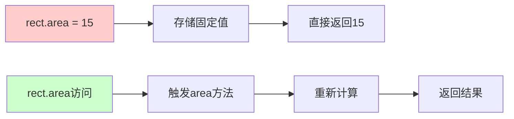
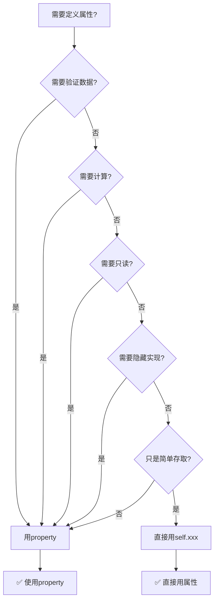

# Python面向对象编程完全指南：类、封装、继承与多态

> 📚 本文通过详细的代码示例和实际应用场景，系统讲解Python面向对象编程的四大核心概念。

## 目录

1. [类与对象基础](#1-类与对象基础)
2. [封装（Encapsulation）](#2-封装encapsulation)
   - [2.5 装饰器详解](#25-装饰器详解property深入理解)
      - [2.5.3.1 为什么要用@property](#2531-为什么要用property而不是直接用属性)
         - [2.5.5.1 @property的执行原理](#2551-property的执行原理)
3. [继承（Inheritance）](#3-继承inheritance)
4. [多态（Polymorphism）](#4-多态polymorphism)
5. [综合实战案例](#5-综合实战案例)
6. [小结](#6-小结)

---

## 1. 类与对象基础

### 1.1 什么是类（Class）？

类是对一类事物的抽象描述，是创建对象的"模板"或"蓝图"。

```python
"""
类示例：定义一个学生类
"""
class Student:
    """学生类"""
    
    # 类属性（所有对象共享）
    school_name = "某某学校"
    
    # 构造方法（初始化）
    def __init__(self, name, age, student_id):
        # 实例属性（每个对象独立）
        self.name = name          # 学生姓名
        self.age = age            # 学生年龄
        self.student_id = student_id  # 学号
        self.grades = []          # 成绩列表
        self.is_enrolled = True   # 是否注册
    
    # 实例方法
    def add_grade(self, grade):
        """添加成绩"""
        self.grades.append(grade)
        return f"已添加成绩: {grade}"
    
    def get_average(self):
        """计算平均分"""
        if not self.grades:
            return 0
        return sum(self.grades) / len(self.grades)
    
    def display_info(self):
        """显示学生信息"""
        avg = self.get_average()
        print(f"=" * 40)
        print(f"学生信息")
        print(f"=" * 40)
        print(f"姓名: {self.name}")
        print(f"年龄: {self.age}")
        print(f"学号: {self.student_id}")
        print(f"学校: {self.school_name}")
        print(f"成绩: {self.grades}")
        print(f"平均分: {avg:.2f}")
        print(f"=" * 40)
```

### 1.2 什么是对象（Object）？

对象是类的实例，是根据类模板创建的具体个体。

```python
# 创建对象（类的实例化）
student1 = Student("张三", 18, "S001")
student2 = Student("李四", 19, "S002")

# 调用对象的方法
student1.add_grade(95)
student1.add_grade(88)
student1.add_grade(92)

student1.display_info()
```

**输出：**
```
========================================
学生信息
========================================
姓名: 张三
年龄: 18
学号: S001
学校: 某某学校
成绩: [95, 88, 92]
平均分: 91.67
========================================
```

### 1.3 self是什么？

`self`是类的实例本身的引用，类似于其他语言中的`this`。

```python
class Person:
    def __init__(self, name):
        # self.name 创建了实例属性 name
        self.name = name
    
    def greet(self):
        # self.name 访问实例属性
        return f"你好，我是{self.name}"

# self自动传递，不需要手动传入
person = Person("小明")
print(person.greet())  # 输出: 你好，我是小明
```

### 1.4 类属性 vs 实例属性

```python
class Dog:
    # 类属性：所有实例共享
    species = "犬科"
    
    def __init__(self, name, age):
        # 实例属性：每个实例独立
        self.name = name
        self.age = age

# 创建实例
dog1 = Dog("旺财", 3)
dog2 = Dog("小白", 5)

# 访问类属性（两种方式都可以）
print(Dog.species)   # 犬科
print(dog1.species)  # 犬科
print(dog2.species)  # 犬科

# 修改类属性（影响所有实例）
Dog.species = "猫科"
print(dog1.species)  # 猫科
print(dog2.species)  # 猫科

# 修改实例属性（不影响其他实例）
dog1.name = "大黄"
print(dog1.name)  # 大黄
print(dog2.name)  # 小白
```

---

## 2. 封装（Encapsulation）

### 2.1 什么是封装？

封装是将数据和操作数据的方法包装在一起，对外隐藏实现细节，只暴露必要的接口。

### 2.2 访问修饰符

Python中没有真正的访问修饰符，但有约定俗称的命名规范：也就是通过命名，非强制性规定，这么设计确实简单易懂，私有属性编辑器会自动检查

```python
class BankAccount:
    """银行账户类"""
    
    def __init__(self, account_id, balance):
        # 公有属性（可以直接访问）
        self.account_id = account_id
        
        # 受保护属性（约定：单下划线开头，外部谨慎访问）
        self._balance = balance
        
        # 私有属性（约定：双下划线开头，外部不应该访问）
        self.__pin = "123456"  # 密码
    
    # 公有方法（外部可以调用）
    def deposit(self, amount):
        """存款"""
        if amount <= 0:
            return "存款金额必须为正"
        self._balance += amount
        return f"成功存入{amount}元，当前余额{self._balance}元"
    
    def withdraw(self, amount, pin):
        """取款"""
        if pin != self.__pin:
            return "密码错误"
        if amount > self._balance:
            return "余额不足"
        self._balance -= amount
        return f"成功取出{amount}元，当前余额{self._balance}元"
    
    def get_balance(self):
        """获取余额（受保护的访问方式）"""
        return self._balance
    
    def __encrypt_data(self):
        """私有方法：加密数据"""
        return "加密后的数据"

# 使用示例
account = BankAccount("ACC001", 10000)

# 公有属性可以直接访问
print(account.account_id)  # ACC001

# 受保护属性可以访问，但不建议
print(account._balance)  # 10000

# 私有属性无法直接访问（会报错）
# print(account.__pin)  # AttributeError

# 应该通过公有方法访问
print(account.get_balance())  # 10000
print(account.deposit(5000))  # 成功存入5000元，当前余额15000元
```

### 2.3 property装饰器（实现getter/setter）

```python
class Person:
    def __init__(self, name, age):
        self.__name = name
        self.__age = age
    
    # getter方法
    @property
    def name(self):
        """获取姓名"""
        return self.__name
    
    # setter方法
    @name.setter
    def name(self, value):
        """设置姓名（带验证）"""
        if not value or len(value) < 2:
            raise ValueError("姓名长度至少2个字符")
        self.__name = value
    
    @property
    def age(self):
        """获取年龄"""
        return self.__age
    
    @age.setter
    def age(self, value):
        """设置年龄（带验证）"""
        if value < 0 or value > 150:
            raise ValueError("年龄必须在0-150之间")
        self.__age = value

# 使用方式像访问属性一样
person = Person("张三", 25)
print(person.name)   # 自动调用getter: 张三
person.name = "李四"  # 自动调用setter: 李四
print(person.age)    # 自动调用getter: 25
```

### 2.4 封装的意义

```python
class Circle:
    """圆类 - 封装计算逻辑"""
    
    def __init__(self, radius):
        # 外部只需要知道半径，不需要知道π等细节
        self.__radius = radius
    
    @property
    def radius(self):
        return self.__radius
    
    @radius.setter
    def radius(self, value):
        if value < 0:
            raise ValueError("半径不能为负")
        self.__radius = value
    
    # 封装了计算逻辑，外部不需要知道实现细节
    @property
    def area(self):
        """计算面积"""
        return 3.14159 * self.__radius ** 2
    
    @property
    def perimeter(self):
        """计算周长"""
        return 2 * 3.14159 * self.__radius

# 使用示例
circle = Circle(5)
print(f"半径: {circle.radius}")           # 5
print(f"面积: {circle.area:.2f}")        # 78.54
print(f"周长: {circle.perimeter:.2f}")    # 31.42
```

**封装的好处：**
1. ✅ **数据保护**：通过私有属性防止随意修改
2. ✅ **接口简洁**：外部不需要知道内部实现
3. ✅ **易于维护**：修改内部实现不影响外部使用
4. ✅ **验证逻辑**：可以在setter中验证数据合法性

### 2.5 装饰器详解（@property深入理解）

装饰器是Python中非常重要的语法，本节将详细讲解它的原理和使用场景。

#### 2.5.1 什么是装饰器？

装饰器是一个**函数**，它可以修改其他函数或方法的行为，而不需要修改原函数的代码。

```python
"""
装饰器示例：计时器
"""

# 这是一个装饰器函数
def timer(func):
    """计时器装饰器：统计函数执行时间"""
    def wrapper(*args, **kwargs):
        import time
        start = time.time()
        result = func(*args, **kwargs)  # 执行原函数
        end = time.time()
        print(f"函数 {func.__name__} 执行耗时: {end - start:.4f}秒")
        return result
    return wrapper

# 使用装饰器（@timer会包装add函数）
@timer
def add(a, b):
    """普通加法函数"""
    return a + b

# 使用
result = add(10, 20)
print(f"结果: {result}")
```

**输出：**
```
结果: 30
函数 add 执行耗时: 0.0001秒
```

#### 2.5.2 @property装饰器原理

`@property`是Python内置的装饰器，用于将方法变成属性访问。

```python
"""
@property 和 @name.setter 详解
"""

class Person:
    def __init__(self, name, age):
        self.__name = name      # 私有属性
        self.__age = age        # 私有属性
    
    # ==================== getter ====================
    # @property装饰的方法会变成属性访问（只读）
    @property
    def name(self):
        """获取姓名"""
        return self.__name
    
    @property
    def age(self):
        """获取年龄"""
        return self.__age
    
    # ==================== setter ====================
    # @name.setter 装饰的方法会处理属性的赋值
    @name.setter
    def name(self, value):
        """设置姓名（带验证）"""
        if not value or len(value) < 2:
            raise ValueError("姓名长度至少2个字符")
        self.__name = value
    
    @age.setter
    def age(self, value):
        """设置年龄（带验证）"""
        if value < 0 or value > 150:
            raise ValueError("年龄必须在0-150之间")
        self.__age = value

# 使用方式：像访问属性一样
person = Person("张三", 25)

# 获取属性（自动调用getter）
print(person.name)   # 张三
print(person.age)    # 25

# 设置属性（自动调用setter）
person.name = "李四"  # 自动验证后设置
person.age = 26

print(person.name)   # 李四
print(person.age)    # 26

# 验证失败会抛出异常
try:
    person.name = "张"  # ValueError: 姓名长度至少2个字符
except ValueError as e:
    print(f"错误: {e}")

try:
    person.age = -5  # ValueError: 年龄必须在0-150之间
except ValueError as e:
    print(f"错误: {e}")
```

#### 2.5.3 没有装饰器 vs 使用装饰器

```python
# ==================== 方式1：不用装饰器（繁琐） ====================
class User:
    def __init__(self, username):
        self.__username = username
    
    # 必须用方法调用，语法不直观
    def get_username(self):
        return self.__username
    
    def set_username(self, value):
        self.__username = value

# 使用时：
user = User("张三")
username = user.get_username()      # 繁琐
user.set_username("李四")          # 繁琐

# ==================== 方式2：使用装饰器（简洁） ====================
class User:
    def __init__(self, username):
        self.__username = username
    
    @property
    def username(self):
        return self.__username
    
    @username.setter
    def username(self, value):
        self.__username = value

# 使用时：
user = User("张三")
username = user.username      # 像访问属性一样！
user.username = "李四"       # 简洁！

#### 2.5.3.1 为什么要用@property而不是直接用属性？

初学者可能会问：为什么不直接定义`self.name = name`，而要用`@property`？主要有以下几个原因：

##### 1. **需要数据验证时**

```python
```
# ❌ 直接属性：无法验证
class User:
    def __init__(self, name):
        self.name = name  # 任何值都能设置，无法验证

user = User("")
user.name = "12345"  # 没人知道这是用户名还是密码
user.name = None      # 居然也能设置！

# ✅ 使用property：可以验证
class User:
    def __init__(self, name):
        self.name = name  # 会自动调用setter进行验证
    
    @property
    def name(self):
        return self.__name
    
    @name.setter
    def name(self, value):
        if not value or len(value) < 2:
            raise ValueError("用户名至少2个字符")
        if not value.isalnum():
            raise ValueError("用户名只能包含字母和数字")
        self.__name = value

user = User("张三")
user.name = ""          # ❌ ValueError: 用户名至少2个字符
user.name = "abc123"    # ✅ 成功
```
```

##### 2. **需要计算属性时**

```python
# ❌ 直接属性：计算结果无法同步
class Rectangle:
    def __init__(self, width, height):
        self.width = width
        self.height = height
        self.area = width * height  # 初始化时计算一次

rect = Rectangle(5, 3)
print(rect.area)   # 15 ✅

# 修改宽高后，面积没有更新！
rect.width = 10
print(rect.area)    # 仍然是15 ❌

# ✅ 使用property：每次访问都重新计算
class Rectangle:
    def __init__(self, width, height):
        self.__width = width
        self.__height = height
    
    @property
    def area(self):
        """面积会自动计算"""
        return self.__width * self.__height
rect = Rectangle(5, 3)
print(rect.area)   # 15 ✅

rect.width = 10
print(rect.area)    # 30 ✅ 自动更新！

#### 2.5.5.1 @property的执行原理

**关键理解**：`@property`不是"存储值"，而是"每次访问时重新计算"！

```python
@property
def area(self):
    """面积会自动计算"""
    return self.__width * self.__height
```

**执行流程：**
```
当你访问 rect.area 时：
    ↓
Python发现area被@property装饰
    ↓
立即调用area()这个方法
    ↓
返回 self.__width * self.__height 的计算结果
```

**实际演示：**

```python
class Rectangle:
    def __init__(self, width, height):
        self.__width = width
        self.__height = height
    
    @property
    def area(self):
        print(f"🔄 正在计算面积: {self.__width} × {self.__height}")
        return self.__width * self.__height

rect = Rectangle(5, 3)

print("第一次访问:")
print(rect.area)

print("\n第二次访问:")
print(rect.area)

print("\n修改宽度后:")
rect._Rectangle__width = 10  # 注意：私有属性访问方式
print(rect.area)
```

**输出：**
```
第一次访问:
🔄 正在计算面积: 5 × 3
15

第二次访问:
🔄 正在计算面积: 5 × 3
15

修改宽度后:
🔄 正在计算面积: 10 × 3
30
```

**可以看到**：每次`print(rect.area)`都会触发`area()`方法的执行！

#### 对比：普通属性 vs @property



**普通属性**：
```python
self.area = width * height  # 存储计算后的值
print(self.area)            # 直接返回存储的值，不变
```

**@property**：
```python
@property
def area(self):
    return self.__width * self.__height  # 每次都重新算

print(self.area)  # 每次都调用area()方法
print(self.area)  # 每次都调用area()方法
print(self.area)  # 每次都调用area()方法
```

**一句话总结**：
- 普通属性：`存储值` → `读取` → **值固定不变**
- `@property`：`读取` → `执行方法` → `返回计算结果` → **每次都重新计算**

这正是`@property`的优势：**数据始终是最新的**，因为每次访问都重新计算，永远不会有数据不一致的问题！

###  2.5.5 计算属性

### 3. **需要只读属性时**


```
直接属性：任何地方都能修改
class Circle:
    def __init__(self, radius):
        self.radius = radius
        self.diameter = radius * 2  # 直径可以被修改（数据不一致）

c = Circle(5)
print(c.radius, c.diameter)  # 5, 10
c.diameter = 100              # 直径被改了，但半径没变！数据不一致！
print(c.radius, c.diameter)  # 5, 100 ❌ 逻辑错误

# ✅ 使用property：直径是只读的计算属性
class Circle:
    def __init__(self, radius):
        self.__radius = radius
    
    @property
    def radius(self):
        return self.__radius
    
    @radius.setter
    def radius(self, value):
        if value <= 0:
            raise ValueError("半径必须为正")
        self.__radius = value
    
    @property
    def diameter(self):
        """直径是只读的计算属性"""
        return self.__radius * 2

c = Circle(5)
print(c.radius, c.diameter)  # 5, 10
c.diameter = 100              # ❌ AttributeError: can't set attribute
c.radius = 10                 # ✅ 修改半径
print(c.radius, c.diameter)   # 10, 20 ✅ 直径自动更新

```

### 4. **需要隐藏实现细节时**

```python
# ❌ 直接暴露属性
class User:
    def __init__(self, name):
        self.name = name
        self.email = name.lower() + "@example.com"  # email依赖于name

user = User("ZHANGSAN")
print(user.email)  # zhangsan@example.com

# 如果直接修改name
user.name = "LISI"
print(user.email)  # zhangsan@example.com ❌ email没变！

# ✅ 使用property隐藏实现
class User:
    def __init__(self, name):
        self.name = name  # 触发setter
    
    @property
    def name(self):
        return self.__name
    
    @name.setter
    def name(self, value):
        self.__name = value
    
    @property
    def email(self):
        """email是计算属性，始终与name保持一致"""
        return self.__name.lower() + "@example.com"

user = User("ZHANGSAN")
print(user.email)  # zhangsan@example.com

user.name = "LISI"
print(user.email)  # lisi@example.com ✅ 自动更新！
```

### 5. **需要延迟加载时**

```python
# ❌ 直接属性：立即加载，可能很慢
class Product:
    def __init__(self, product_id):
        self.product_id = product_id
        # 立即加载所有数据，可能很慢
        self.reviews = self.load_reviews_from_db()  # 每次都加载
        self.related_products = self.load_related()   # 每次都加载

# ✅ 使用property：按需加载
class Product:
    def __init__(self, product_id):
        self.product_id = product_id
        self.__reviews = None  # 延迟加载
        self.__related = None
    
    @property
    def reviews(self):
        """按需加载，只有访问时才从数据库加载"""
        if self.__reviews is None:
            self.__reviews = self.load_reviews_from_db()
        return self.__reviews
    
    @property
    def related_products(self):
        if self.__related is None:
            self.__related = self.load_related()
        return self.__related
```

### 什么时候用property？



**总结：**

| 场景 | 推荐方式 |
|------|----------|
| 简单存取，不需要验证 | 直接用`self.name` |
| 需要数据验证 | 用`@property` + `@name.setter` |
| 需要计算属性 | 用`@property` |
| 需要只读属性 | 只用`@property` |
| 需要隐藏实现细节 | 用`@property` |

**一句话总结**：`@property`让我们在保持简洁语法的同时，获得了数据验证、计算能力、封装性等面向对象的优势！

### 2.5.4 只读属性

如果只定义`@property`而不定义`@xxx.setter`，该属性就是**只读**的。

```python
class Circle:
    def __init__(self, radius):
        self.__radius = radius
    
    @property
    def radius(self):
        """只读属性"""
        return self.__radius
    
    # 没有定义 @radius.setter，所以radius不能被赋值

c = Circle(5)
print(c.radius)     # 5
c.radius = 10      # AttributeError: property 'radius' has no setter
```

#### 2.5.5 计算属性

`@property`最强大的用法是创建**计算属性**，让方法像属性一样访问。

```python
class Rectangle:
    def __init__(self, width, height):
        self.width = width
        self.height = height
    
    @property
    def area(self):
        """计算面积 - 不需要括号！"""
        return self.width * self.height
    
    @property
    def perimeter(self):
        """计算周长 - 不需要括号！"""
        return 2 * (self.width + self.height)
    
    @property
    def is_square(self):
        """判断是否是正方形"""
        return self.width == self.height

rect = Rectangle(5, 3)

# 像访问属性一样调用方法（不需要括号）
print(f"面积: {rect.area}")       # 15
print(f"周长: {rect.perimeter}") # 16
print(f"是正方形: {rect.is_square}")  # False
```

#### 2.5.6 常见的内置装饰器

| 装饰器 | 作用 | 示例 |
|--------|------|------|
| `@property` | 把方法变成属性（只读） | `obj.prop` |
| `@name.setter` | 定义属性的setter | `obj.prop = value` |
| `@classmethod` | 类方法，第一个参数是cls | `Class.method()` |
| `@staticmethod` | 静态方法，不需要self/cls | `Class.method()` |
| `@abstractmethod` | 抽象方法，必须被子类实现 | 定义接口 |

#### 2.5.7 综合应用示例

```python
"""
综合应用：银行账户类
"""

class BankAccount:
    """银行账户 - 展示装饰器的实际应用"""
    
    def __init__(self, account_id, balance):
        self.__account_id = account_id
        self.__balance = balance
        self.__transactions = []
        self.__transaction_count = 0
    
    # ==================== 只读属性 ====================
    @property
    def account_id(self):
        """账户ID（只读）"""
        return self.__account_id
    
    @property
    def balance(self):
        """余额（只读）"""
        return self.__balance
    
    @property
    def transaction_count(self):
        """交易次数（只读）"""
        return self.__transaction_count
    
    # ==================== 计算属性 ====================
    @property
    def balance_display(self):
        """格式化余额显示"""
        return f"¥{self.__balance:,.2f}"
    
    @property
    def recent_transactions(self):
        """最近10笔交易"""
        return self.__transactions[-10:]
    
    # ==================== setter（带验证） ====================
    @balance.setter
    def balance(self, value):
        """直接设置余额（带验证）"""
        if value < 0:
            raise ValueError("余额不能为负数")
        self.__balance = value
    
    # ==================== 业务方法 ====================
    def deposit(self, amount):
        """存款"""
        if amount <= 0:
            raise ValueError("存款金额必须为正")
        self.__balance += amount
        self.__transactions.append(f"+{amount}")
        self.__transaction_count += 1
        return f"成功存入{amount}元，余额: {self.balance_display}"
    
    def withdraw(self, amount):
        """取款"""
        if amount <= 0:
            raise ValueError("取款金额必须为正")
        if amount > self.__balance:
            raise ValueError("余额不足")
        self.__balance -= amount
        self.__transactions.append(f"-{amount}")
        self.__transaction_count += 1
        return f"成功取出{amount}元，余额: {self.balance_display}"

# 使用示例
account = BankAccount("ACC001", 10000)

# 只读属性
print(f"账户ID: {account.account_id}")        # ACC001
print(f"余额: {account.balance_display}")      # ¥10,000.00
print(f"交易次数: {account.transaction_count}") # 0

# 业务操作
print(account.deposit(5000))    # 成功存入5000元，余额: ¥15,000.00
print(account.withdraw(2000))   # 成功取出2000元，余额: ¥13,000.00

# 查看交易记录
print(f"交易记录: {account.recent_transactions}")
print(f"总交易次数: {account.transaction_count}")

# 不能直接修改只读属性
# account.account_id = "ACC002"  # AttributeError
```

**输出：**
```
账户ID: ACC001
余额: ¥10,000.00
交易次数: 0
成功存入5000元，余额: ¥15,000.00
成功取出2000元，余额: ¥13,000.00
交易记录: ['+5000', '-2000']
总交易次数: 2
```

#### 2.5.8 装饰器总结

```mermaid
graph LR
    A[普通方法] --> B[@property装饰器]
    B --> C[变成只读属性]
    B --> D[@name.setter装饰器]
    D --> E[可读写属性]

    F[优点] --> G[语法简洁]
    F --> H[数据验证]
    F --> I[封装性好]
    F --> J[计算属性]
```

**什么时候使用@property？**

1. ✅ 需要**验证数据**时
2. ✅ 需要**只读属性**时
3. ✅ **计算属性**不想用括号调用时
4. ✅ 需要**隐藏实现细节**时

**一句话总结**：`@property`让方法像属性一样访问，`@name.setter`控制属性的赋值，两者结合实现优雅的数据封装！

---

## 3. 继承（Inheritance）

### 3.1 什么是继承？

继承允许我们定义一个类继承另一个类的属性和方法。

```python
# 父类（基类）
class Animal:
    def __init__(self, name, age):
        self.name = name
        self.age = age
    
    def speak(self):
        """动物叫声"""
        return "..."
    
    def move(self):
        """动物移动"""
        return "移动中..."

# 子类（派生类）
class Dog(Animal):
    """狗类 - 继承自动物类"""
    
    def __init__(self, name, age, breed):
        # 调用父类的构造方法
        super().__init__(name, age)
        self.breed = breed  # 扩展：新增属性
    
    def speak(self):
        """重写父类方法：狗叫"""
        return "汪汪汪！"
    
    def fetch(self):
        """新增方法：捡球"""
        return f"{self.name}正在捡球"

class Cat(Animal):
    """猫类 - 继承自动物类"""
    
    def __init__(self, name, age, color):
        super().__init__(name, age)
        self.color = color
    
    def speak(self):
        """重写父类方法：猫叫"""
        return "喵喵喵！"
    
    def climb(self):
        """新增方法：爬树"""
        return f"{self.name}正在爬树"

# 使用示例
dog = Dog("旺财", 3, "金毛")
cat = Cat("小白", 2, "白色")

print(f"狗: {dog.name}, {dog.speak()}, {dog.fetch()}")
print(f"猫: {cat.name}, {cat.speak()}, {cat.climb()}")
```

### 3.2 单继承与多继承

```python
# 单继承
class A:
    def method_a(self):
        return "A的方法"

class B(A):  # B继承A
    pass

# 多继承
class C:
    def method_c(self):
        return "C的方法"

class D(A, C):  # D同时继承A和C
    def method_d(self):
        return "D的方法"

# MRO（方法解析顺序）
print(D.__mro__)  # 显示继承顺序
```

### 3.3 super()函数

`super()`用于调用父类的方法，是初始化和方法重写的重要工具。

```python
class Vehicle:
    def __init__(self, brand, color):
        self.brand = brand
        self.color = color
    
    def display(self):
        return f"{self.color}色的{self.brand}"

class Car(Vehicle):
    def __init__(self, brand, color, doors):
        # 调用父类的构造方法
        super().__init__(brand, color)
        self.doors = doors
    
    def display(self):
        # 调用父类的方法并扩展
        parent_info = super().display()
        return f"{parent_info}，有{self.doors}个门"

car = Car("丰田", "黑色", 4)
print(car.display())  # 黑色色的丰田，有4个门
```

### 3.4 方法重写（Override）

子类可以重写父类的方法，实现自己的逻辑。

```python
class Shape:
    def area(self):
        """计算面积"""
        raise NotImplementedError("子类必须实现此方法")

class Rectangle(Shape):
    def __init__(self, width, height):
        self.width = width
        self.height = height
    
    def area(self):
        """重写：矩形面积"""
        return self.width * self.height

class Circle(Shape):
    def __init__(self, radius):
        self.radius = radius
    
    def area(self):
        """重写：圆形面积"""
        return 3.14159 * self.radius ** 2

# 使用
shapes = [Rectangle(5, 3), Circle(4)]
for shape in shapes:
    print(f"面积: {shape.area()}")
```

### 3.5 继承的类型

```
# 单继承：一个子类继承一个父类
class A: pass
class B(A): pass

# 多继承：一个子类继承多个父类
class C: pass
class D: pass
class E(A, C, D): pass

# 多层继承：A -> B -> C
class A: pass
class B(A): pass
class C(B): pass
```


**继承的意义：**
1. ✅ **代码复用**：子类复用父类的代码
2. ✅ **层次结构**：建立清晰的类层次
3. ✅ **扩展功能**：在子类中添加新功能
4. ✅ **多态基础**：继承是多态的前提

---

## 4. 多态（Polymorphism）

### 4.1 什么是多态？

多态是指同一操作作用于不同对象时，产生不同的行为。Python中的多态是"鸭子类型"（Duck Typing）实现的。 本质是实例

```python
"""
多态示例：不同动物发出不同叫声
"""

class Animal:
    def speak(self):
        raise NotImplementedError("子类必须实现speak方法")

class Dog(Animal):
    def speak(self):
        return "汪汪汪！"

class Cat(Animal):
    def speak(self):
        return "喵喵喵！"

class Duck(Animal):
    def speak(self):
        return "嘎嘎嘎！"

# 多态的体现：同一函数处理不同类型的对象
def make_speak(animal):
    """让动物发出叫声"""
    return animal.speak()

# 创建不同动物
animals = [Dog(), Cat(), Duck()]

# 同一操作产生不同结果
for animal in animals:
    print(f"{animal.__class__.__name__}: {make_speak(animal)}")
```

**输出：**
```
Dog: 汪汪汪！
Cat: 喵喵喵！
Duck: 嘎嘎嘎！
```

### 4.2 抽象基类（Abstract Base Class）

使用`ABC`模块定义抽象基类，强制子类实现某些方法。

```python
from abc import ABC, abstractmethod

class Shape(ABC):
    """抽象形状类"""
    
    @abstractmethod
    def area(self):
        """抽象方法：计算面积"""
        pass
    
    @abstractmethod
    def perimeter(self):
        """抽象方法：计算周长"""
        pass
    
    def display(self):
        """普通方法：显示信息"""
        return f"面积: {self.area()}, 周长: {self.perimeter()}"

class Square(Shape):
    def __init__(self, side):
        self.side = side
    
    def area(self):
        return self.side ** 2
    
    def perimeter(self):
        return 4 * self.side

# 不能直接实例化抽象类
# shape = Shape()  # TypeError

# 必须实现所有抽象方法
square = Square(5)
print(square.display())  # 面积: 25, 周长: 20
```

### 4.3 运算符重载（Operator Overloading）

Python允许重载运算符，使自定义对象支持运算符操作。

```python
class Vector:
    """向量类 - 演示运算符重载"""
    
    def __init__(self, x, y):
        self.x = x
        self.y = y
    
    # 加法重载
    def __add__(self, other):
        return Vector(self.x + other.x, self.y + other.y)
    
    # 减法重载
    def __sub__(self, other):
        return Vector(self.x - other.x, self.y - other.y)
    
    # 乘法重载（标量乘法）
    def __mul__(self, scalar):
        return Vector(self.x * scalar, self.y * scalar)  
    
    # 字符串表示
    def __str__(self):
        return f"Vector({self.x}, {self.y})"
    
    # 长度
    def __len__(self):
        return int((self.x**2 + self.y**2) ** 0.5)

# 使用运算符
v1 = Vector(3, 4)
v2 = Vector(1, 2)

print(v1 + v2)    # Vector(4, 6)
print(v1 - v2)    # Vector(2, 2)
print(v1 * 2)     # Vector(6, 8)
print(len(v1))     # 5
```

### 4.4 静态方法和类方法

```python
class MyClass:
    class_attribute = "类属性"
    
    def __init__(self, value):
        self.instance_attribute = value
    
    # 实例方法：第一个参数是self
    def instance_method(self):
        return f"实例方法，访问: {self.instance_attribute}"
    
    # 类方法：第一个参数是cls
    @classmethod
    def class_method(cls):
        return f"类方法，访问: {cls.class_attribute}"
    
    # 静态方法：没有self或cls参数
    @staticmethod
    def static_method():
        return "静态方法，与类无关"

# 调用方式
obj = MyClass("value")
print(obj.instance_method())  # 实例方法调用
print(MyClass.class_method())  # 类方法调用
print(MyClass.static_method()) # 静态方法调用
```

**多态的意义：**
1. ✅ **接口统一**：不同对象使用相同接口
2. ✅ **灵活扩展**：新增子类无需修改现有代码
3. ✅ **解耦**：调用方不需要知道具体类型
4. ✅ **代码简洁**：用统一的方式处理不同对象

---

## 5. 综合实战案例

### 5.1 电商系统

```python
from abc import ABC, abstractmethod
from datetime import datetime

# 抽象基类：产品
class Product(ABC):
    def __init__(self, product_id, name, price):
        self.product_id = product_id
        self.name = name
        self.price = price
    
    @abstractmethod
    def get_discount(self):
        """抽象方法：获取折扣"""
        pass
    
    def display(self):
        """显示产品信息"""
        return f"{self.name} - ¥{self.price} (折扣: {self.get_discount()})"

# 电子产品
class Electronics(Product):
    def __init__(self, product_id, name, price, warranty):
        super().__init__(product_id, name, price)
        self.warranty = warranty
    
    def get_discount(self):
        """电子产品8折"""
        return 0.8

# 服装
class Clothing(Product):
    def __init__(self, product_id, name, price, season):
        super().__init__(product_id, name, price)
        self.season = season
    
    def get_discount(self):
        """服装7折"""
        return 0.7

# 图书
class Book(Product):
    def __init__(self, product_id, name, price, author):
        super().__init__(product_id, name, price)
        self.author = author
    
    def get_discount(self):
        """图书9折"""
        return 0.9

# 购物车
class ShoppingCart:
    def __init__(self):
        self.items = []
    
    def add_item(self, product, quantity=1):
        self.items.append({
            'product': product,
            'quantity': quantity
        })
    
    def calculate_total(self):
        """计算总价"""
        total = 0
        for item in self.items:
            product = item['product']
            quantity = item['quantity']
            discounted_price = product.price * product.get_discount()
            total += discounted_price * quantity
        return total
    
    def display_receipt(self):
        """显示购物小票"""
        print("=" * 50)
        print("购物小票")
        print("=" * 50)
        for item in self.items:
            product = item['product']
            quantity = item['quantity']
            discounted = product.price * product.get_discount()
            print(f"{product.name:20s} x{quantity:2d}  ¥{discounted:6.2f}")
        print("=" * 50)
        print(f"{'总计':22s}  ¥{self.calculate_total():6.2f}")
        print("=" * 50)

# 使用示例
cart = ShoppingCart()
cart.add_item(Electronics("E001", "手机", 3000, "1年"))
cart.add_item(Clothing("C001", "T恤", 200, "夏季"))
cart.add_item(Book("B001", "Python入门", 80, "张三"))

cart.display_receipt()
```

### 5.2 动物管理系统

```python
class Animal:
    def __init__(self, name, age):
        self.name = name
        self.age = age
    
    def speak(self):
        return "..."
    
    def move(self):
        return "移动"

class Flyable:
    """飞行能力接口"""
    def fly(self):
        return "正在飞翔"

class Swimmable:
    """游泳能力接口"""
    def swim(self):
        return "正在游泳"

class Dog(Animal):
    def speak(self):
        return "汪汪汪"
    
    def fetch(self):
        return "捡球"

class Duck(Animal, Flyable, Swimmable):
    def speak(self):
        return "嘎嘎嘎"
    
    def fly(self):
        return "展翅高飞"
    
    def swim(self):
        return "水中嬉戏"

# 多态使用
def animal_concert(animals):
    """动物音乐会"""
    for animal in animals:
        print(f"{animal.name}: {animal.speak()}")

animals = [Dog("旺财", 3), Duck("唐老鸭", 2)]
animal_concert(animals)

# 检查是否有飞行能力
duck = Duck("小黄", 1)
if isinstance(duck, Flyable):
    print(duck.fly())
```

---

## 6. 小结

### 📚 四大核心概念总结

| 概念 | 关键词 | 作用 | Python实现 |
|------|--------|------|------------|
| **类** | 模板、蓝图 | 抽象事物特征 | `class ClassName` |
| **对象** | 实例、具体 | 类的具体化 | `obj = ClassName()` |
| **封装** | 隐藏、保护 | 保护数据安全 | `self.__private` |
| **继承** | 复用、扩展 | 复用父类代码 | `class Child(Parent)` |
| **多态** | 同一接口、不同行为 | 灵活处理不同对象 | 方法重写、抽象基类 |

### 🎯 学习路径

```
1. 先掌握类和对象基础
   ↓
2. 理解封装（数据保护）
   ↓
3. 学习继承（代码复用）
   ↓
4. 掌握多态（灵活扩展）
```

### 💡 最佳实践

1. **类设计原则**
   - 单一职责：每个类只做一件事
   - 开闭原则：对扩展开放，对修改关闭
   - 优先组合：优先使用组合而非继承

2. **命名规范**
   - 类名：首字母大写（PascalCase）
   - 方法名：小写加下划线（snake_case）
   - 私有成员：双下划线开头

3. **代码示例**
   ```python
   # 好的封装
   class User:
       def __init__(self, username, email):
           self.__password = None  # 私有
       
       @property
       def password(self):
           # getter
           return "***"
       
       @password.setter
       def password(self, value):
           # setter with validation
           if len(value) < 6:
               raise ValueError("密码至少6位")
           self.__password = value
   ```

### 📖 进阶学习

- 设计模式（单例、工厂、策略等）
- 元编程（装饰器、 metaclasses）
- ORM框架（SQLAlchemy、Django ORM）
- 领域驱动设计（DDD）

---

**📅 文章信息**：
- 作者：你的名字
- 发表日期：2026-08-10
- 阅读量：0

**🏷️ 标签**：`Python` `面向对象` `OOP` `封装` `继承` `多态` `装饰器` `property`
