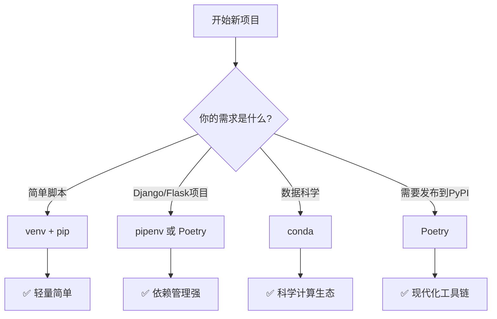

# Python包管理与虚拟环境完全指南

> 📚 本文详细介绍Python的包管理工具和虚拟环境管理，帮助你掌握项目依赖管理的核心技能。

## 目录

1. [为什么需要包管理和虚拟环境？](#1-为什么需要包管理和虚拟环境)
2. [pip包管理器](#2-pip包管理器)
3. [venv虚拟环境](#3-venv虚拟环境)
4. [virtualenv虚拟环境](#4-virtualenv虚拟环境)
5. [pipenv一键管理](#5-pipenv一键管理)
6. [Poetry现代包管理](#6-poetry现代包管理)
7. [conda环境管理](#7-conda环境管理)
8. [最佳实践与常见问题](#8-最佳实践与常见问题)
9. [总结](#9-总结)
10. [常用Python库快速参考](#10-常用python库快速参考)

---

## 1. 为什么需要包管理和虚拟环境？

### 1.1 包管理解决的问题

Python的强大之处在于有丰富的第三方库。但随之而来的是**版本管理问题**：

```
❌ 没有包管理的问题：

项目A需要Django 2.0
项目B需要Django 4.0
全局安装一个Django版本 → 冲突！

❌ 没有虚拟环境的问题：

你开发了10个项目
每个项目依赖不同版本的包
升级一个包的版本 → 其他项目可能崩溃！
```

### 1.2 虚拟环境的作用

```
✅ 使用虚拟环境：

项目A虚拟环境 → Django 2.0
项目B虚拟环境 → Django 4.0
完全隔离，互不影响！

项目A虚拟环境
├── Python 3.9
├── Django 2.0
├── requests 2.25
└── numpy 1.19

项目B虚拟环境（独立）
├── Python 3.11
├── Django 4.0
├── requests 2.28
└── numpy 1.24
```

### 1.3 核心概念

| 概念 | 说明 |
|------|------|
| **包（Package）** | 别人写好的代码库，可以复用 |
| **依赖（Dependency）** | 项目需要的包 |
| **版本** | 包的特定版本号（如requests 2.28.0） |
| **虚拟环境** | 隔离的Python运行环境 |
| **包管理器** | 安装、升级、卸载包的工具 |

---

## 2. pip包管理器

### 2.1 pip简介

`pip`是Python官方推荐的包管理器，随Python 3.4+一起安装。

```bash
# 检查pip版本
pip --version
# pip 23.2.1 from /usr/local/lib/python3.11/site-packages

# 升级pip
pip install --upgrade pip
```

### 2.2 常用命令

```bash
# 安装包
pip install requests              # 安装最新版本
pip install requests==2.28.0    # 安装指定版本
pip install "requests>=2.0"    # 安装满足条件的版本

# 升级包
pip install --upgrade requests

# 卸载包
pip uninstall requests
pip uninstall -y requests       # 自动确认

# 查看已安装的包
pip list                        # 列出所有包
pip list --outdated            # 列出可升级的包

# 搜索包
pip search requests             # 需要pip-search插件

# 查看包信息
pip show requests              # 显示包的详细信息

# 导出依赖
pip freeze > requirements.txt  # 导出所有依赖到文件

# 从文件安装
pip install -r requirements.txt
```

### 2.3 requirements.txt

**依赖文件**是项目管理的核心文件：

```bash
# requirements.txt示例
Django==4.2.0
requests==2.28.0
numpy==1.24.0
pandas==2.0.0
```

```bash
# 安装所有依赖
pip install -r requirements.txt
```

### 2.4 依赖版本符号

| 符号 | 含义 | 示例 |
|------|------|------|
| `==` | 精确版本 | `requests==2.28.0` |
| `>=` | 大于等于 | `requests>=2.28.0` |
| `<=` | 小于等于 | `requests<=3.0.0` |
| `>` | 大于 | `requests>2.0` |
| `<` | 小于 | `requests<3.0` |
| `~=` | 兼容版本 | `requests~=2.28`（2.28.x都行） |
| `!=` | 不等于 | `requests!=2.28.0` |

### 2.5 pip国内镜像

```bash
# 临时使用镜像
pip install requests -i https://pypi.tuna.tsinghua.edu.cn/simple

# 永久配置镜像
pip config set global.index-url https://pypi.tuna.tsinghua.edu.cn/simple
```

**常用镜像源**：
- 清华：`https://pypi.tuna.tsinghua.edu.cn/simple`
- 阿里：`https://mirrors.aliyun.com/pypi/simple`
- 腾讯：`https://mirrors.cloud.tencent.com/pypi/simple`

---

## 3. venv虚拟环境

### 3.1 venv简介

`venv`是Python 3.3+内置的虚拟环境模块，无需额外安装。

### 3.2 创建虚拟环境

```bash
# 创建虚拟环境
python -m venv myenv

# 指定Python版本（系统有多个Python时）
python3.11 -m venv myenv
```

### 3.3 激活虚拟环境

**Linux/macOS：**
```bash
source myenv/bin/activate
```

**Windows：**
```bash
myenv\Scripts\activate
```

### 3.4 使用虚拟环境

```bash
# 激活后，命令行会显示虚拟环境名称
(myenv) $ pip install django

# 安装的包只在当前虚拟环境中有效
(myenv) $ pip list
Django==4.2.0
pip==23.2.1

# 退出虚拟环境
deactivate
```

### 3.5 完整工作流程

```bash
# 1. 创建项目目录
mkdir myproject
cd myproject

# 2. 创建虚拟环境
python -m venv venv

# 3. 激活虚拟环境
source venv/bin/activate

# 4. 安装依赖
pip install django requests

# 5. 导出依赖文件
pip freeze > requirements.txt

# 6. 其他人复现环境
# （在新机器上）
pip install -r requirements.txt

# 7. 退出虚拟环境
deactivate
```

### 3.6 .gitignore配置

```bash
# .gitignore中添加
venv/
env/
.env
__pycache__/
*.pyc
```

---

## 4. virtualenv虚拟环境

### 4.1 virtualenv简介

`virtualenv`是`venv`的前身，功能更丰富，但需要单独安装。

```bash
# 安装
pip install virtualenv

# 创建虚拟环境（比venv更灵活）
virtualenv myenv

# 指定Python版本
virtualenv -p python3.11 myenv

# 创建不含系统包的最小环境
virtualenv --no-site-packages myenv
```

### 4.2 virtualenvwrapper（可选）

简化virtualenv的使用：

```bash
# 安装
pip install virtualenvwrapper

# 配置（添加到~/.bashrc或~/.zshrc）
export WORKON_HOME=~/.virtualenvs
source /usr/local/bin/virtualenvwrapper.sh

# 常用命令
mkvirtualenv myenv      # 创建环境
workon myenv           # 激活环境
deactivate             # 退出环境
rmvirtualenv myenv     # 删除环境
lsvirtualenv          # 列出所有环境
```

---

## 5. pipenv一键管理

### 5.1 pipenv简介

`pipenv`将`pip`和`venv`结合，自动管理虚拟环境和依赖文件。

```bash
# 安装
pip install pipenv

# 在项目目录中安装依赖
pipenv install requests

# 同时安装为开发依赖
pipenv install --dev pytest
```

### 5.2 Pipfile和Pipfile.lock

`pipenv`使用`Pipfile`代替`requirements.txt`：

```toml
# Pipfile示例
[[source]]
url = "https://pypi.org/simple"
verify_ssl = true
name = "pypi"

[packages]
django = "==4.2.0"
requests = "~=2.28"

[dev-packages]
pytest = "*"

[requires]
python_version = "3.11"
```

### 5.3 常用命令

```bash
# 安装依赖
pipenv install

# 安装包
pipenv install requests

# 安装开发依赖
pipenv install --dev pytest

# 激活虚拟环境
pipenv shell

# 运行脚本（无需激活）
pipenv run python app.py

# 锁定依赖
pipenv lock

# 卸载包
pipenv uninstall requests

# 查看依赖图
pipenv graph

# 移除虚拟环境
pipenv --rm
```

### 5.4 Pipfile.lock

`Pipfile.lock`锁定精确版本，确保环境一致：

```json
{
    "_meta": {
        "sources": [...],
        "python": {...}
    },
    "default": {
        "django": {
            "version": "==4.2.0",
            "hashes": [...]
        }
    }
}
```

---

## 6. Poetry现代包管理

### 6.1 Poetry简介

`Poetry`是现代化的Python包和依赖管理器，提供完整的项目打包和发布工具。

```bash
# 安装
curl -sSL https://install.python-poetry.org | python3 -
# 或
pip install poetry
```

### 6.2 初始化项目

```bash
# 创建新项目
poetry new myproject

# 初始化现有项目
cd existing-project
poetry init
```

### 6.3 pyproject.toml

`poetry`使用`pyproject.toml`作为配置文件：

```toml
[tool.poetry]
name = "myproject"
version = "0.1.0"
description = "My awesome project"
authors = ["Your Name <you@example.com>"]

[tool.poetry.dependencies]
python = "^3.9"
django = "^4.2"
requests = "^2.28"

[tool.poetry.dev-dependencies]
pytest = "^7.0"

[tool.poetry.scripts]
myapp = "myapp:main"
```

### 6.4 常用命令

```bash
# 安装依赖
poetry install

# 添加包
poetry add requests
poetry add pytest --dev

# 移除包
poetry remove requests

# 更新依赖
poetry update

# 锁定版本
poetry lock

# 激活虚拟环境
poetry shell

# 运行脚本
poetry run python app.py

# 构建包
poetry build

# 发布到PyPI
poetry publish
```

### 6.5 虚拟环境管理

```bash
# 查看虚拟环境路径
poetry env info

# 指定Python版本
poetry env use python3.11

# 列出所有虚拟环境
poetry env list
```

---

## 7. conda环境管理

### 7.1 conda简介

`conda`是Anaconda发行的包和环境管理器，擅长管理数据科学相关的包。

```bash
# 检查版本
conda --version

# 更新conda
conda update conda
```

### 7.2 环境管理

```bash
# 创建环境
conda create --name myenv python=3.11

# 创建特定环境（包含常用包）
conda create --name myenv python=3.11 numpy pandas matplotlib

# 激活环境
conda activate myenv

# 退出环境
conda deactivate

# 删除环境
conda env remove --name myenv
```

### 7.3 包管理

```bash
# 安装包
conda install numpy
conda install numpy=1.24

# 搜索包
conda search numpy

# 查看已安装
conda list

# 更新包
conda update numpy

# 卸载包
conda remove numpy
```

### 7.4 环境导出与复现

```bash
# 导出环境
conda env export > environment.yml

# 从文件创建环境
conda env create --file environment.yml
```

**environment.yml示例**：
```yaml
name: myenv
channels:
  - defaults
  - conda-forge
dependencies:
  - python=3.11
  - numpy=1.24.0
  - pandas=2.0.0
```

### 7.5 conda vs pip

| 特性 | conda | pip |
|------|-------|-----|
| 包来源 | Anaconda仓库 | PyPI |
| 非Python包 | ✅ 支持 | ❌ 不支持 |
| 环境隔离 | ✅ 原生支持 | 需要venv/virtualenv |
| 环境复制 | ✅ 跨平台兼容 | 部分支持 |
| 学习曲线 | 较陡 | 简单 |

---

## 8. 最佳实践与常见问题

### 8.1 选择建议



### 8.2 项目结构推荐

```
myproject/
├── venv/                 # 虚拟环境（不提交到git）
├── src/                  # 源代码
│   └── mypackage/
│       ├── __init__.py
│       └── main.py
├── tests/                # 测试代码
│   └── test_main.py
├── docs/                 # 文档
├── requirements.txt      # 生产依赖
├── requirements-dev.txt  # 开发依赖
├── setup.py             # 安装配置
├── README.md            # 项目说明
└── .gitignore          # Git忽略配置
```

### 8.3 requirements文件管理

**开发环境依赖**（requirements.txt）：
```
Django==4.2.0
requests==2.28.0
```

**开发环境额外依赖**（requirements-dev.txt）：
```
-r requirements.txt    # 包含生产依赖
pytest==7.4.0
black==23.7.0
flake8==6.1.0
```

**安装开发依赖**：
```bash
pip install -r requirements-dev.txt
```

### 8.4 常见问题

#### 问题1：安装失败

```bash
# 清理缓存
pip cache purge

# 使用国内镜像
pip install requests -i https://pypi.tuna.tsinghua.edu.cn/simple

# 检查Python版本兼容性
```

#### 问题2：卸载不干净

```bash
# 查找残留文件
find . -name "*.pyc"
find . -name "__pycache__"

# 清理
rm -rf __pycache__
rm -rf *.egg-info
```

#### 问题3：环境无法复现

```bash
# 确保锁定版本
pip freeze > requirements.txt

# 检查系统差异
python --version
pip --version
```

### 8.5 Windows/macOS/Linux差异

**路径差异**：
```bash
# Linux/macOS
source venv/bin/activate
venv/bin/python

# Windows
venv\Scripts\activate
venv\Scripts\python
```

**Python命令差异**：
```bash
# Linux/macOS
python3
pip3

# Windows（通常）
python
pip
```

### 8.6 Docker中的Python环境

**Dockerfile示例**：
```dockerfile
FROM python:3.11-slim

WORKDIR /app

# 复制依赖文件
COPY requirements.txt .

# 安装依赖
RUN pip install --no-cache-dir -r requirements.txt

# 复制代码
COPY . .

CMD ["python", "app.py"]
```

---

## 9. 总结

### 9.1 工具对比

| 工具 | 适用场景 | 优点 | 缺点 |
|------|---------|------|------|
| **pip + venv** | 通用场景 | 轻量、内置 | 需要手动管理 |
| **pipenv** | Web应用 | 一体化管理 | 社区相对较小 |
| **Poetry** | 现代项目 | 功能全面 | 学习曲线 |
| **conda** | 数据科学 | 生态丰富 | 较重 |

### 9.2 推荐工作流

**小型脚本**：
```bash
python -m venv venv
source venv/bin/activate
pip install -r requirements.txt
```

**Web项目**：
```bash
poetry new myproject
cd myproject
poetry add django requests
poetry shell
```

**数据科学**：
```bash
conda create --name myenv python=3.11
conda activate myenv
conda install numpy pandas matplotlib
conda env export > environment.yml
```

### 9.3 关键要点

1. ✅ **始终使用虚拟环境**，不要污染全局Python环境
2. ✅ **锁定依赖版本**，确保环境可复现
3. ✅ **使用国内镜像**，加速包下载
4. ✅ **定期更新依赖**，修复安全漏洞
5. ✅ **分离生产和开发依赖**，保持环境干净
6. ✅ **提交依赖文件**，方便团队协作

### 9.4 一句话总结

> **"用虚拟环境隔离项目，用pip/Poetry管理依赖，用requirements.txt/Pipfile记录依赖，永远不要在全局Python环境安装包！"**

---

## 10. 常用Python库快速参考

### 10.1 Web开发库

| 库名 | 安装命令 | 说明 |
|------|-----------|------|
| **Django** | `pip install django` | 全功能Web框架 |
| **Flask** | `pip install flask` | 轻量级微框架 |
| **FastAPI** | `pip install fastapi` | 现代高性能API框架 |
| **requests** | `pip install requests` | HTTP客户端 |
| **httpx** | `pip install httpx` | 异步HTTP客户端 |
| **Django REST Framework** | `pip install djangorestframework` | REST API框架 |

### 10.2 数据科学库

| 库名 | 安装命令 | 说明 |
|------|-----------|------|
| **NumPy** | `pip install numpy` | 数值计算基础 |
| **Pandas** | `pip install pandas` | 数据分析工具 |
| **SciPy** | `pip install scipy` | 科学计算 |
| **Matplotlib** | `pip install matplotlib` | 数据可视化 |
| **Seaborn** | `pip install seaborn` | 统计可视化 |

### 10.3 机器学习库

| 库名 | 安装命令 | 说明 |
|------|-----------|------|
| **Scikit-learn** | `pip install scikit-learn` | 机器学习基础库 |
| **PyTorch** | `pip install torch` | 深度学习框架 |
| **TensorFlow** | `pip install tensorflow` | Google深度学习 |
| **XGBoost** | `pip install xgboost` | 梯度提升树 |
| **Transformers** | `pip install transformers` | NLP预训练模型 |

### 10.4 爬虫库

| 库名 | 安装命令 | 说明 |
|------|-----------|------|
| **BeautifulSoup** | `pip install beautifulsoup4` | HTML解析 |
| **Scrapy** | `pip install scrapy` | 完整爬虫框架 |
| **Selenium** | `pip install selenium` | 浏览器自动化 |
| **lxml** | `pip install lxml` | 高性能XML/HTML解析 |

### 10.5 常用工具库

| 库名 | 安装命令 | 说明 |
|------|-----------|------|
| **click** | `pip install click` | 命令行接口创建 |
| **Typer** | `pip install typer` | FastAPI风格CLI |
| **pydantic** | `pip install pydantic` | 数据验证 |
| **python-dotenv** | `pip install python-dotenv` | 环境变量管理 |
| **loguru** | `pip install loguru` | 简洁日志库 |
| **arrow** | `pip install arrow` | 人性化日期时间 |

### 10.6 常用数据科学环境一键安装

```bash
# 创建数据科学虚拟环境
python -m venv ds-env
source ds-env/bin/activate

# 安装常用数据科学库
pip install numpy pandas matplotlib seaborn jupyter scikit-learn xgboost lightgbm

# 导出依赖
pip freeze > requirements-datascience.txt
```

### 10.7 常用Web开发环境一键安装

```bash
# 创建Web开发虚拟环境
python -m venv web-env
source web-env/bin/activate

# 安装Web开发库
pip install django flask fastapi requests sqlalchemy pydantic python-dotenv loguru

# 安装开发工具
pip install black flake8 pytest

# 导出依赖
pip freeze > requirements-web.txt
```

---

## 📚 相关资源

- [Python官方文档 - venv](https://docs.python.org/3/library/venv.html)
- [pip用户指南](https://pip.pypa.io/en/stable/user_guide/)
- [Poetry文档](https://python-poetry.org/docs/)
- [Conda用户指南](https://docs.conda.io/projects/conda/en/latest/)

---

**📅 文章信息**：
- 作者：你的名字
- 发表日期：2026-08-11
- 阅读量：0

**🏷️ 标签**：`Python` `包管理` `pip` `venv` `虚拟环境` `Poetry` `conda`
