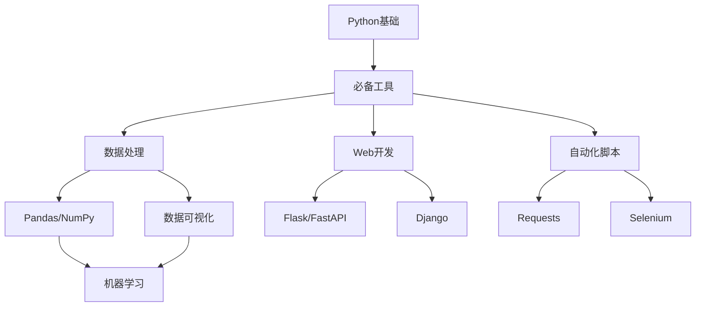

# Python常用第三方库完全总结

> 📚 本文全面总结Python最常用的第三方库，涵盖各个领域的核心工具库。

## 目录

1. [Web开发](#1-web开发)
2. [数据科学与分析](#2-数据科学与分析)
3. [机器学习与深度学习](#3-机器学习与深度学习)
4. [网络爬虫](#4-网络爬虫)
5. [异步编程](#5-异步编程)
6. [工具与工具库](#6-工具与工具库)
7. [GUI开发](#7-gui开发)
8. [游戏开发](#8-游戏开发)
9. [总结与选择建议](#9-总结与选择建议)

---

## 1. Web开发

### 1.1 主流Web框架

| 库名 | 说明 | 特点 | 学习曲线 |
|------|------|------|----------|
| **Django** | 全功能Web框架 |  batteries-included、功能全面 | ⭐⭐⭐ |
| **Flask** | 轻量级微框架 | 灵活、可扩展 | ⭐⭐ |
| **FastAPI** | 现代高性能框架 | 自动文档、类型提示、异步支持 | ⭐⭐ |
| **Pyramid** | 中型框架 | 灵活、适合中等规模 | ⭐⭐⭐ |
| **Bottle** | 极简框架 | 单文件、无依赖 | ⭐ |

```python
# Django示例
import django
from django.shortcuts import render
from django.http import HttpResponse

def index(request):
    return HttpResponse("Hello Django!")

# Flask示例
from flask import Flask
app = Flask(__name__)

@app.route('/')
def index():
    return "Hello Flask!"

# FastAPI示例
from fastapi import FastAPI
app = FastAPI()

@app.get("/")
async def index():
    return {"message": "Hello FastAPI!"}
```

### 1.2 API相关库

| 库名 | 说明 |
|------|------|
| **requests** | HTTP客户端，简单易用 |
| **httpx** | 异步HTTP客户端 |
| **aiohttp** | 异步HTTP服务端/客户端 |
| **urllib** | Python标准库，内置HTTP工具 |
| **FastAPI** | 自动生成API文档 |

```python
# requests示例
import requests

response = requests.get("https://api.example.com/data")
data = response.json()

# httpx异步示例
import httpx

async with httpx.AsyncClient() as client:
    response = await client.get("https://api.example.com/data")
    data = response.json()
```

### 1.3 REST API框架

| 库名 | 说明 |
|------|------|
| **DRF (Django REST Framework)** | Django专用REST API框架 |
| **FastAPI** | 自动OpenAPI文档、类型验证 |
| **Flask-RESTful** | Flask的REST API扩展 |

---

## 2. 数据科学与分析

### 2.1 核心库

| 库名 | 说明 | 用途 |
|------|------|------|
| **NumPy** | 数值计算基础库 | 数组、矩阵运算 |
| **Pandas** | 数据分析工具 | 数据清洗、分析、可视化 |
| **SciPy** | 科学计算库 | 统计、优化、积分 |
| **Numba** | JIT编译器 | 加速数值计算 |

```python
import numpy as np
import pandas as pd

# NumPy示例
arr = np.array([1, 2, 3, 4, 5])
print(np.mean(arr))  # 3.0
print(np.sum(arr))   # 15

# Pandas示例
df = pd.DataFrame({
    'name': ['Alice', 'Bob', 'Charlie'],
    'age': [25, 30, 35],
    'score': [85, 90, 95]
})
print(df.describe())
print(df.groupby('age').mean())
```

### 2.2 数据可视化

| 库名 | 说明 | 特点 |
|------|------|------|
| **Matplotlib** | 基础绘图库 | 功能全面、可定制 |
| **Seaborn** | 统计可视化 | 简洁、样式美观 |
| **Plotly** | 交互式图表 | 支持缩放、悬停 |
| **Altair** | 声明式可视化 | 简洁语法 |
| **Bokeh** | 交互式Web图表 | 支持大数据集 |

```python
import matplotlib.pyplot as plt
import seaborn as sns

# Matplotlib示例
plt.figure(figsize=(10, 6))
plt.plot([1, 2, 3, 4], [1, 4, 9, 16])
plt.xlabel('X轴')
plt.ylabel('Y轴')
plt.title('简单图表')
plt.show()

# Seaborn示例
sns.set_style("whitegrid")
sns.barplot(x='day', y='total_bill', data=tips)
```

### 2.3 时间序列

| 库名 | 说明 |
|------|------|
| **pandas** | 内置时间序列支持 |
| **Prophet** | Facebook时间序列预测 |
| **statsmodels** | 统计模型、预测 |
| **TSFresh** | 时间序列特征提取 |

---

## 3. 机器学习与深度学习

### 3.1 机器学习

| 库名 | 说明 | 特点 |
|------|------|------|
| **Scikit-learn** | 机器学习基础库 | 全面、易用、入门首选 |
| **XGBoost** | 梯度提升树 | 高性能、Kaggle常胜 |
| **LightGBM** | 微软轻量级GBM | 快速、内存高效 |
| **CatBoost** | Yandex梯度提升 | 处理类别特征强 |

```python
from sklearn.ensemble import RandomForestClassifier
from sklearn.model_selection import train_test_split
from sklearn.metrics import accuracy_score

# 准备数据
X_train, X_test, y_train, y_test = train_test_split(X, y, test_size=0.2)

# 训练模型
model = RandomForestClassifier(n_estimators=100)
model.fit(X_train, y_train)

# 预测
y_pred = model.predict(X_test)
print(f"准确率: {accuracy_score(y_test, y_pred):.2f}")
```

### 3.2 深度学习

| 库名 | 说明 | 特点 |
|------|------|------|
| **PyTorch** | Facebook出品 | 动态图、灵活、研究首选 |
| **TensorFlow** | Google出品 | 生态完善、生产环境强 |
| **Keras** | TF的高级API | 简单易用、适合入门 |
| **JAX** | Google新品 | 函数式、自动微分 |

```python
import torch
import torch.nn as nn

# PyTorch示例
class SimpleNet(nn.Module):
    def __init__(self):
        super().__init__()
        self.fc = nn.Linear(784, 10)

    def forward(self, x):
        return self.fc(x)

model = SimpleNet()
optimizer = torch.optim.Adam(model.parameters(), lr=0.001)
loss_fn = nn.CrossEntropyLoss()
```

### 3.3 NLP自然语言处理

| 库名 | 说明 | 特点 |
|------|------|------|
| **Transformers** | HuggingFace | 预训练模型丰富 |
| **NLTK** | 经典NLP工具包 | 教学、词法分析 |
| **spaCy** | 工业级NLP | 高效、命名实体识别 |
| **jieba** | 中文分词 | 中文处理必备 |

```python
from transformers import pipeline

# 情感分析
classifier = pipeline("sentiment-analysis")
result = classifier("I love this movie!")
print(result)  # [{'label': 'POSITIVE', 'score': 0.999}]

# 中文分词
import jieba
text = "我喜欢Python编程"
words = jieba.cut(text)
print("/".join(words))  # 我/喜欢/Python/编程
```

---

## 4. 网络爬虫

| 库名 | 说明 | 特点 |
|------|------|------|
| **requests** | HTTP请求 | 基础、简单 |
| **BeautifulSoup** | HTML解析 | 简单易用 |
| **Scrapy** | 完整爬虫框架 | 功能强大、异步 |
| **Selenium** | 浏览器自动化 | 支持JS渲染 |
| **Playwright** | 现代浏览器自动化 | 微软出品、快速 |
| **lxml** | XML/HTML解析 | 高性能、C语言实现 |

```python
import requests
from bs4 import BeautifulSoup

# 简单爬虫示例
response = requests.get("https://example.com")
soup = BeautifulSoup(response.text, 'html.parser')

# 提取标题
title = soup.find('h1').text

# 提取所有链接
links = [a.get('href') for a in soup.find_all('a')]

# Scrapy示例
import scrapy

class MySpider(scrapy.Spider):
    name = 'myspider'
    start_urls = ['https://example.com']

    def parse(self, response):
        yield {'title': response.css('h1::text').get()}
```

---

## 5. 异步编程

| 库名 | 说明 | 特点 |
|------|------|------|
| **asyncio** | Python标准库 | 异步基础 |
| **aiohttp** | 异步HTTP | 高并发爬虫 |
| **FastAPI** | 异步Web框架 | 自动异步支持 |
| **celery** | 分布式任务队列 | 异步任务处理 |
| **Trio** | 现代异步库 | 结构化并发 |

```python
import asyncio

async def fetch_data(url):
    async with aiohttp.ClientSession() as session:
        async with session.get(url) as response:
            return await response.json()

async def main():
    tasks = [fetch_data(url) for url in urls]
    results = await asyncio.gather(*tasks)
    print(results)

asyncio.run(main())
```

---

## 6. 工具与工具库

### 6.1 日志与调试

| 库名 | 说明 |
|------|------|
| **logging** | Python标准库，内置日志 |
| **loguru** | 简洁日志库 |
| **pdb** | Python调试器 |
| **ipdb** | IPython调试器 |

### 6.2 日期时间

| 库名 | 说明 |
|------|------|
| **datetime** | Python标准库 |
| **arrow** | 人性化日期时间 |
| **pendulum** | 更好的日期时间 |
| **python-dateutil** | 日期解析 |

### 6.3 配置管理

| 库名 | 说明 |
|------|------|
| **python-dotenv** | 环境变量管理 |
| **PyYAML** | YAML配置解析 |
| **toml** | TOML配置解析 |
| **configparser** | INI文件解析 |

```python
from dotenv import load_dotenv
import os

load_dotenv()  # 加载.env文件
API_KEY = os.getenv('API_KEY')

# YAML示例
import yaml
with open('config.yaml') as f:
    config = yaml.safe_load(f)
```

### 6.4 命令行工具

| 库名 | 说明 | 特点 |
|------|------|------|
| **click** | 命令行接口创建 | 简洁、装饰器 |
| **Typer** | FastAPI风格CLI | 类型提示 |
| **Argparse** | Python标准库 | 内置 |
| **Fire** | 自动生成CLI | 简单自动 |

```python
import click

@click.command()
@click.option('--name', default='World', help='名字')
@click.option('--count', default=1, type=int, help='重复次数')
def hello(name, count):
    for _ in range(count):
        click.echo(f'Hello {name}!')

hello()
```

### 6.5 验证与序列化

| 库名 | 说明 | 特点 |
|------|------|------|
| **pydantic** | 数据验证 | 类型提示、自动验证 |
| **marshmallow** | 对象序列化 | 灵活、ORM集成 |
| **JSON** | Python标准库 | 内置JSON支持 |
| **msgpack** | 高效二进制序列化 | 高性能 |

```python
from pydantic import BaseModel, EmailStr

class User(BaseModel):
    name: str
    email: EmailStr
    age: int

user = User(name="Alice", email="alice@example.com", age=25)
print(user.model_dump())
```

---

## 7. GUI开发

| 库名 | 说明 | 特点 |
|------|------|------|
| **Tkinter** | Python标准库 | 内置、简单 |
| **PyQt/PySide** | Qt框架绑定 | 功能强大、商业级 |
| **wxPython** | wxWidgets绑定 | 原生外观 |
| **Kivy** | 跨平台GUI | 移动端支持 |
| **DearPyGui** | 现代GPU加速GUI | 快速、实时 |

```python
# Tkinter示例
import tkinter as tk

root = tk.Tk()
label = tk.Label(root, text="Hello Tkinter!")
label.pack()
root.mainloop()

# PyQt示例
from PyQt5.QtWidgets import QApplication, QLabel

app = QApplication([])
label = QLabel('Hello PyQt!')
label.show()
app.exec_()
```

---

## 8. 游戏开发

| 库名 | 说明 | 特点 |
|------|------|------|
| **Pygame** | 游戏开发基础库 | 2D游戏、入门 |
| **Pyglet** | 多媒体库 | 高性能 |
| **Arcade** | 现代2D游戏库 | 面向对象 |
| **Cocos2d** | 游戏引擎 | 完整工具链 |

```python
import pygame

pygame.init()
screen = pygame.display.set_mode((800, 600))
running = True

while running:
    for event in pygame.event.get():
        if event.type == pygame.QUIT:
            running = False
    screen.fill((255, 255, 255))
    pygame.display.flip()

pygame.quit()
```

---

## 9. 总结与选择建议

### 9.1 按领域推荐

| 领域 | 推荐组合 |
|------|---------|
| **Web开发** | Django + DRF / FastAPI + SQLAlchemy |
| **数据分析** | Pandas + NumPy + Matplotlib |
| **机器学习** | Scikit-learn + XGBoost + MLflow |
| **深度学习** | PyTorch / TensorFlow |
| **爬虫** | Requests + BeautifulSoup + Scrapy |
| **自动化运维** | Fabric + Ansible |
| **API开发** | FastAPI + Pydantic |
| **GUI应用** | PyQt / Tkinter |
| **游戏开发** | Pygame |

### 9.2 Python 3.10+ 新特性相关

| 库名 | 说明 |
|------|------|
| **dataclass** | Python 3.7+ 内置 |
| **typing** | 类型提示标准库 |
| **enum** | 枚举类型标准库 |
| **pathlib** | 路径操作标准库 |
| ** functools** | 函数式编程标准库 |

### 9.3 学习路径建议



### 9.4 一句话推荐

| 场景 | 推荐库 |
|------|--------|
| 快速Web API | **FastAPI** |
| 全功能Web应用 | **Django** |
| 数据分析 | **Pandas + Matplotlib** |
| 机器学习入门 | **Scikit-learn** |
| 深度学习 | **PyTorch** |
| 爬虫入门 | **Requests + BeautifulSoup** |
| 自动化测试 | **Selenium + pytest** |
| 命令行工具 | **Click / Typer** |
| GUI应用 | **PyQt** |
| 游戏开发 | **Pygame** |

---

## 📚 参考资源

- [Awesome Python](https://github.com/vinta/awesome-python) - Python资源大全
- [Python Wiki - Libraries](https://wiki.python.org/moin/UsefulModules)
- [PyPI Statistics](https://pypistats.org/) - 包使用统计

---

**📅 文章信息**：
- 作者：母亚含
- 发表日期：2026-08-11
- 阅读量：0

**🏷️ 标签**：`Python` `第三方库` `常用库` `Web开发` `数据科学` `机器学习`
