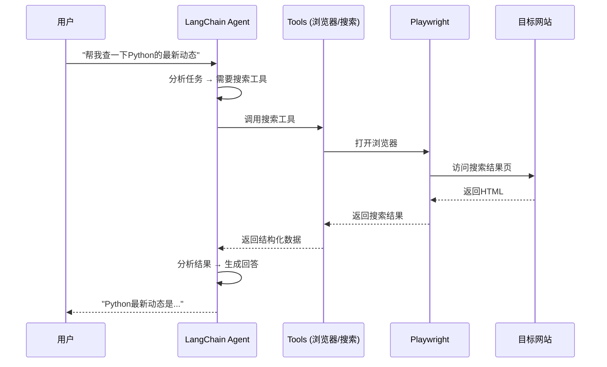
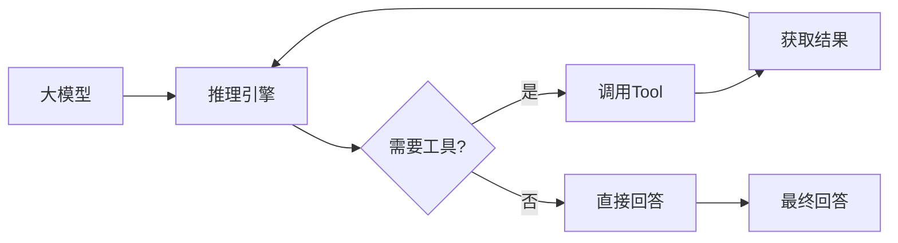

# LangChain智能体与指纹浏览器集成实战

> 📚 本文介绍如何将LangChain Agent与Playwright指纹浏览器集成，创建能够自动浏览网页、获取信息、处理内容的智能助手。

## 目录

1. [整体架构](#1-整体架构)
2. [LangChain Agent简介](#2-langchain-agent简介)
3. [环境配置](#3-环境配置)
4. [基础实现](#4-基础实现)
5. [指纹浏览器Tool实现](#5-指纹浏览器tool实现)
6. [完整的Agent示例](#6-完整的agent示例)
7. [FastAPI服务封装](#7-fastapi服务封装)
8. [Docker部署](#8-docker部署)

---

## 1. 整体架构

### 1.1 架构图

```
┌─────────────────────────────────────────────────────────────┐
│                      用户请求                                │
└──────────────────────┬──────────────────────────────────────┘
                       │
                       ▼
┌─────────────────────────────────────────────────────────────┐
│                    LangChain Agent                           │
│  ┌─────────────────────────────────────────────────────┐   │
│  │              推理引擎（ReAct / Tool Calling）        │   │
│  └─────────────────────────────────────────────────────┘   │
│                              │                              │
│           ┌──────────────────┼──────────────────┐           │
│           ▼                  ▼                  ▼           │
│     ┌──────────┐      ┌──────────┐      ┌──────────┐    │
│     │ 搜索工具 │      │ 浏览器工具 │      │ 其它工具  │    │
│     │ Tavily   │      │ Playwright│      │  计算器   │    │
│     └──────────┘      └──────────┘      └──────────┘    │
└──────────────────────┬──────────────────────────────────────┘
                       │
                       ▼
┌─────────────────────────────────────────────────────────────┐
│                    指纹浏览器 (Playwright)                    │
│  ┌─────────────────────────────────────────────────────┐   │
│  │ User-Agent | Canvas | WebGL | 时区 | 代理         │   │
│  └─────────────────────────────────────────────────────┘   │
│                              │                              │
│                              ▼                              │
│                    目标网站 / 搜索结果                       │
└─────────────────────────────────────────────────────────────┘
```

### 1.2 工作流程



---

## 2. LangChain Agent简介

### 2.1 什么是Agent？

Agent是能够**自主决策**使用工具来完成复杂任务的AI系统。

```
传统问答：用户 → 直接回答
Agent工作：用户 → 思考 → 使用工具 → 获取信息 → 思考 → 回答
```

### 2.2 Agent核心组件



### 2.3 LangChain Agent类型

| Agent类型 | 说明 | 适用场景 |
|-----------|------|---------|
| **ReAct** | 推理+行动+观察循环 | 复杂推理任务 |
| **Tool Calling** | 直接调用工具 | 结构化工具调用 |
| **OpenAI Functions** | OpenAI专用 | 精确工具调用 |
| **Self Ask** | 自问自答 | 需要分解的问题 |

---

## 3. 环境配置

### 3.1 依赖文件

```txt
# requirements.txt
# 核心框架
langchain==0.1.0
langchain-core==0.1.10
langchain-community==0.0.10
langgraph==0.0.15

# 大模型
langchain-minimax==0.1.0  # MiniMax模型
# 或者使用
openai==1.12.0

# 浏览器自动化
playwright==1.40.0
beautifulsoup4==4.12.2
lxml==5.1.0

# 搜索
tavily-python==0.3.0

# Web服务
fastapi==0.109.0
uvicorn[standard]==0.27.0

# 工具
python-dotenv==1.0.0
pydantic==2.5.3
```

### 3.2 安装命令

```bash
# 创建虚拟环境
python -m venv agent-env
source agent-env/bin/activate

# 安装依赖
pip install -r requirements.txt

# 安装Playwright浏览器
playwright install chromium
playwright install-deps chromium  # Linux系统依赖
```

### 3.3 环境变量配置

```bash
# .env
# MiniMax API (你当前的配置)
MINIMAX_API_KEY=gw-f43c25a3-d060-44ea-8f26-46d0a0033f3c
MINIMAX_BASE_URL=https://minnimax.chat/v1
MINIMAX_MODEL=MiniMax-M2.7

# Tavily搜索 (可选)
TAVILY_API_KEY=tvly-dev-xxxxxxxxxxxx

# API服务
API_HOST=0.0.0.0
API_PORT=8000
```

---

## 4. 基础实现

### 4.1 初始化LLM

```python
# llm_config.py
import os
from dotenv import load_dotenv

load_dotenv()

# MiniMax LLM配置
LLM_CONFIG = {
    "model": os.getenv("MINIMAX_MODEL", "MiniMax-M2.7"),
    "base_url": os.getenv("MINIMAX_BASE_URL", "https://minnimax.chat/v1"),
    "api_key": os.getenv("MINIMAX_API_KEY"),
    "temperature": 0.7,
    "max_tokens": 2000
}

def get_llm():
    """获取LLM实例"""
    from langchain_minimax import ChatMiniMax

    return ChatMiniMax(
        model=LLM_CONFIG["model"],
        base_url=LLM_CONFIG["base_url"],
        api_key=LLM_CONFIG["api_key"],
        temperature=LLM_CONFIG["temperature"],
        max_tokens=LLM_CONFIG["max_tokens"]
    )
```

### 4.2 简单的ReAct Agent

```python
# simple_agent.py
from llm_config import get_llm
from langchain.agents import AgentType, initialize_agent
from langchain.agents.agent_toolkits import (
    PlaywrightBrowserToolkit,
    create_playwright_agent
)

def create_simple_agent():
    """创建简单的Agent"""
    llm = get_llm()

    # 创建Agent（不使用浏览器）
    tools = []  # 先用空工具测试

    agent = initialize_agent(
        tools=tools,
        llm=llm,
        agent=AgentType.ZERO_SHOT_REACT_DESCRIPTION,
        verbose=True,
        handle_parsing_errors=True
    )

    return agent

if __name__ == "__main__":
    agent = create_simple_agent()

    # 测试
    response = agent.run("你好，请介绍一下你自己")
    print(response)
```

---

## 5. 指纹浏览器Tool实现

### 5.1 Playwright浏览器工具类

```python
# browser_tools.py
from typing import Optional
from langchain.tools import tool
from playwright.async_api import async_playwright, Browser, BrowserContext, Page
import asyncio

class FingerprintBrowser:
    """指纹浏览器管理器"""

    def __init__(self):
        self.playwright = None
        self.browser: Optional[Browser] = None
        self.context: Optional[BrowserContext] = None

    async def init(self):
        """初始化浏览器"""
        if self.playwright is None:
            self.playwright = await async_playwright().start()

        if self.browser is None:
            self.browser = await self.playwright.chromium.launch(
                headless=True,
                args=[
                    '--no-sandbox',
                    '--disable-setuid-sandbox',
                    '--disable-dev-shm-usage',
                    '--disable-blink-features=AutomationControlled',
                ]
            )

    async def create_context_with_fingerprint(
        self,
        user_agent: str = None,
        locale: str = "zh-CN",
        timezone: str = "Asia/Shanghai",
        viewport: dict = None
    ) -> BrowserContext:
        """创建带指纹的浏览器上下文"""
        if self.browser is None:
            await self.init()

        # 默认指纹配置
        default_ua = (
            "Mozilla/5.0 (Windows NT 10.0; Win64; x64) AppleWebKit/537.36 "
            "(KHTML, like Gecko) Chrome/120.0.0.0 Safari/537.36"
        )

        self.context = await self.browser.new_context(
            user_agent=user_agent or default_ua,
            viewport=viewport or {"width": 1920, "height": 1080},
            locale=locale,
            timezone_id=timezone,
            ignore_https_errors=True
        )

        return self.context

    async def close(self):
        """关闭浏览器"""
        if self.context:
            await self.context.close()
        if self.browser:
            await self.browser.close()
        if self.playwright:
            await self.playwright.stop()


# 全局浏览器实例
browser_manager = FingerprintBrowser()


# ============ LangChain Tools ============

@tool
async def browse_url(url: str) -> str:
    """
    访问指定URL，获取网页内容和标题。
    适用于需要查看特定网页内容的场景。

    参数:
        url: 网页的完整URL地址

    返回:
        网页的标题和主要内容
    """
    try:
        context = await browser_manager.create_context_with_fingerprint()
        page = await context.new_page()

        await page.goto(url, wait_until="domcontentloaded", timeout=30000)

        # 获取标题
        title = await page.title()

        # 获取内容（简化处理）
        content = await page.evaluate('''() => {
            const main = document.querySelector("main") || document.body;
            return main.innerText.substring(0, 3000);
        }''')

        await page.close()
        await context.close()

        return f"标题: {title}\n\n内容预览:\n{content[:2000]}..."

    except Exception as e:
        return f"访问URL失败: {str(e)}"


@tool
async def search_and_scrape(query: str, max_results: int = 5) -> str:
    """
    搜索查询并抓取搜索结果页面。
    适用于需要搜索信息并查看多个结果的场景。

    参数:
        query: 搜索关键词
        max_results: 最大结果数量

    返回:
        搜索结果列表
    """
    try:
        # 使用Google搜索（示例）
        search_url = f"https://www.google.com/search?q={query}&num={max_results}"

        context = await browser_manager.create_context_with_fingerprint()
        page = await context.new_page()

        await page.goto(search_url, wait_until="domcontentloaded", timeout=30000)

        # 提取搜索结果
        results = await page.evaluate('''() => {
            const items = document.querySelectorAll("div.g");
            const results = [];
            items.forEach((item, i) => {
                if (i >= 5) return;
                const title = item.querySelector("h3")?.innerText || "";
                const link = item.querySelector("a")?.href || "";
                const snippet = item.querySelector("div.IsZvec")?.innerText || "";
                if (title) {
                    results.push({ title, link, snippet });
                }
            });
            return results;
        }''')

        await page.close()
        await context.close()

        if not results:
            return f"未找到关于'{query}'的搜索结果"

        # 格式化输出
        output = [f"关于'{query}'的搜索结果:\n"]
        for i, r in enumerate(results, 1):
            output.append(f"{i}. {r['title']}")
            output.append(f"   链接: {r['link']}")
            output.append(f"   摘要: {r.get('snippet', '')[:200]}...")
            output.append("")

        return "\n".join(output)

    except Exception as e:
        return f"搜索失败: {str(e)}"


@tool
async def take_screenshot(url: str, full_page: bool = False) -> str:
    """
    对指定URL进行截图。
    适用于需要保存网页视觉快照的场景。

    参数:
        url: 网页URL
        full_page: 是否截取整页

    返回:
        截图保存路径
    """
    import base64
    from datetime import datetime

    try:
        context = await browser_manager.create_context_with_fingerprint()
        page = await context.new_page()

        await page.goto(url, wait_until="load", timeout=30000)

        # 生成文件名
        timestamp = datetime.now().strftime("%Y%m%d_%H%M%S")
        filename = f"/tmp/screenshot_{timestamp}.png"

        # 截图
        await page.screenshot(path=filename, full_page=full_page)

        await page.close()
        await context.close()

        return f"截图已保存到: {filename}"

    except Exception as e:
        return f"截图失败: {str(e)}"


@tool
async def get_page_links(url: str, selector: str = "a") -> str:
    """
    获取页面上所有链接。
    适用于需要探索网站结构的场景。

    参数:
        url: 网页URL
        selector: CSS选择器，默认"a"获取所有链接

    返回:
        链接列表
    """
    try:
        context = await browser_manager.create_context_with_fingerprint()
        page = await context.new_page()

        await page.goto(url, wait_until="domcontentloaded", timeout=30000)

        links = await page.evaluate(f'''() => {{
            const elements = document.querySelectorAll("{selector}");
            const urls = [];
            elements.forEach(el => {{
                const href = el.href;
                const text = el.innerText.trim();
                if (href && href.startsWith("http")) {{
                    urls.push({{ text: text.substring(0, 50), href }});
                }}
            }});
            return urls.slice(0, 20);
        }}''')

        await page.close()
        await context.close()

        if not links:
            return f"在{url}未找到链接"

        output = [f"在{url}找到的链接:\n"]
        for link in links:
            output.append(f"- {link['text']}: {link['href']}")

        return "\n".join(output)

    except Exception as e:
        return f"获取链接失败: {str(e)}"
```

---

## 6. 完整的Agent示例

### 6.1 创建带浏览器工具的Agent

```python
# browser_agent.py
from llm_config import get_llm
from browser_tools import (
    browse_url,
    search_and_scrape,
    take_screenshot,
    get_page_links
)
from langchain.agents import AgentType, initialize_agent
from langchain.prompts import MessagesPlaceholder
from langchain.agents.agent_toolkits import create_openai_functions_agent

def create_browser_agent():
    """创建带浏览器工具的Agent"""

    llm = get_llm()

    # 注册浏览器工具
    tools = [
        browse_url,
        search_and_scrape,
        take_screenshot,
        get_page_links
    ]

    # System prompt
    system_prompt = """你是一个智能助手，能够使用浏览器工具访问网页、搜索信息。
    
    可用的工具:
    - browse_url: 访问特定URL获取内容
    - search_and_scrape: 搜索关键词并获取结果
    - take_screenshot: 对网页截图
    - get_page_links: 获取页面所有链接

    使用指南:
    1. 分析用户问题，确定需要什么信息
    2. 如果需要最新信息，使用搜索工具
    3. 如果需要特定页面内容，使用browse_url
    4. 如果需要探索网站结构，使用get_page_links
    5. 整理信息，给出完整回答

    始终尽量提供准确的信息，基于实际获取的网页内容。"""

    # 创建Agent
    agent = initialize_agent(
        tools=tools,
        llm=llm,
        agent=AgentType.STRUCTURED_CHAT_ZERO_SHOT_REACT_DESCRIPTION,
        verbose=True,
        max_iterations=10,
        handle_parsing_errors=True,
        system_message=system_prompt
    )

    return agent

if __name__ == "__main__":
    agent = create_browser_agent()

    # 测试1: 搜索最新新闻
    print("=" * 50)
    print("测试1: 搜索Python最新动态")
    print("=" * 50)
    response = agent.run("请帮我搜索一下今天Python编程语言的最新动态和新闻")
    print(response)

    # 测试2: 访问特定页面
    print("\n" + "=" * 50)
    print("测试2: 获取GitHub页面内容")
    print("=" * 50)
    response = agent.run("请访问Python官方文档网站 https://docs.python.org/ 获取主要内容")
    print(response)
```

### 6.2 使用LangGraph的Agent

```python
# graph_agent.py
from langgraph.prebuilt import create_react_agent
from langgraph.checkpoint.memory import MemorySaver
from llm_config import get_llm
from browser_tools import (
    browse_url,
    search_and_scrape,
    take_screenshot,
    get_page_links
)

def create_graph_agent():
    """使用LangGraph创建Agent"""

    llm = get_llm()

    tools = [
        browse_url,
        search_and_scrape,
        take_screenshot,
        get_page_links
    ]

    # 创建带内存的Agent
    checkpointer = MemorySaver()

    agent = create_react_agent(
        llm,
        tools,
        checkpointer=checkpointer,
        state_modifier="""你是一个智能助手，能够使用浏览器工具。
请基于实际获取的网页内容回答问题，不要编造信息。"""
    )

    return agent

def run_agent_query(agent, query: str, thread_id: str = "default"):
    """运行Agent查询"""
    from langchain_core.messages import HumanMessage

    config = {"configurable": {"thread_id": thread_id}}

    response = agent.invoke(
        {"messages": [HumanMessage(content=query)]},
        config
    )

    return response["messages"][-1].content


if __name__ == "__main__":
    agent = create_graph_agent()

    # 运行查询
    result = run_agent_query(
        agent,
        "搜索一下机器学习领域的最新研究进展",
        thread_id="ml-news"
    )

    print("Agent回答:")
    print(result)
```

---

## 7. FastAPI服务封装

### 7.1 完整的API服务

```python
# app/main.py
from fastapi import FastAPI, HTTPException
from pydantic import BaseModel
from typing import Optional
from contextlib import asynccontextmanager
from browser_tools import browser_manager
from browser_agent import create_browser_agent
from graph_agent import create_graph_agent

# 全局Agent实例
agent = None
graph_agent = None

@asynccontextmanager
async def lifespan(app: FastAPI):
    """应用生命周期管理"""
    global agent, graph_agent

    # 启动时初始化
    print("🚀 初始化浏览器...")
    await browser_manager.init()

    print("🤖 初始化Agent...")
    agent = create_browser_agent()
    graph_agent = create_graph_agent()

    print("✅ 服务就绪!")

    yield

    # 关闭时清理
    print("🧹 关闭浏览器...")
    await browser_manager.close()

app = FastAPI(
    title="LangChain浏览器Agent API",
    description="基于LangChain和Playwright的智能浏览助手",
    version="1.0.0",
    lifespan=lifespan
)

class QueryRequest(BaseModel):
    query: str
    use_graph: bool = False
    thread_id: Optional[str] = "default"

class QueryResponse(BaseModel):
    response: str
    tools_used: list[str] = []

@app.post("/api/query", response_model=QueryResponse)
async def query(request: QueryRequest):
    """
    向Agent发送查询

    参数:
        query: 用户问题
        use_graph: 是否使用LangGraph版本
        thread_id: 对话线程ID（用于LangGraph版本）
    """
    try:
        if request.use_graph and graph_agent:
            # 使用LangGraph版本
            from graph_agent import run_agent_query
            response = run_agent_query(
                graph_agent,
                request.query,
                request.thread_id
            )
        elif agent:
            # 使用标准Agent版本
            response = agent.run(request.query)
        else:
            raise HTTPException(status_code=500, detail="Agent未初始化")

        return QueryResponse(response=response)

    except Exception as e:
        raise HTTPException(status_code=500, detail=str(e))

@app.post("/api/agent/reset")
async def reset_agent():
    """重置Agent状态"""
    global graph_agent
    graph_agent = create_graph_agent()
    return {"message": "Agent已重置"}

@app.get("/health")
async def health():
    """健康检查"""
    return {
        "status": "healthy",
        "browser_ready": browser_manager.browser is not None
    }

if __name__ == "__main__":
    import uvicorn
    uvicorn.run(app, host="0.0.0.0", port=8000)
```

### 7.2 API使用示例

```bash
# 启动服务
uvicorn app.main:app --host 0.0.0.0 --port 8000

# 查询示例
curl -X POST http://localhost:8000/api/query \
  -H "Content-Type: application/json" \
  -d '{
    "query": "搜索Python 3.12的新特性"
  }'

# 使用LangGraph版本（带记忆）
curl -X POST http://localhost:8000/api/query \
  -H "Content-Type: application/json" \
  -d '{
    "query": "继续上面的话题，还有什么要补充的吗？",
    "use_graph": true,
    "thread_id": "python-discussion"
  }'
```

---

## 8. Docker部署

### 8.1 Dockerfile

```dockerfile
FROM python:3.11-slim

WORKDIR /app

# 安装系统依赖
RUN apt-get update && apt-get install -y \
    wget \
    gnupg \
    ca-certificates \
    fonts-liberation \
    libasound2 \
    libatk-bridge2.0-0 \
    libatk1.0-0 \
    libcups2 \
    libdrm2 \
    libgbm1 \
    libgtk-3-0 \
    libnspr4 \
    libnss3 \
    libx11-xcb1 \
    libxcomposite1 \
    libxdamage1 \
    libxrandr2 \
    xdg-utils \
    && rm -rf /var/lib/apt/lists/*

# 复制依赖文件
COPY requirements.txt .

# 安装Python依赖
RUN pip install --no-cache-dir -r requirements.txt

# 安装Playwright浏览器
RUN playwright install chromium --with-deps

# 复制应用代码
COPY app/ ./app/

# 环境变量
ENV PYTHONUNBUFFERED=1

# 暴露端口
EXPOSE 8000

# 启动命令
CMD ["uvicorn", "app.main:app", "--host", "0.0.0.0", "--port", "8000"]
```

### 8.2 docker-compose.yml

```yaml
version: '3.8'

services:
  langchain-browser-agent:
    build: .
    container_name: langchain-agent
    ports:
      - "8000:8000"
    environment:
      - MINIMAX_API_KEY=${MINIMAX_API_KEY}
      - MINIMAX_BASE_URL=${MINIMAX_BASE_URL}
      - MINIMAX_MODEL=${MINIMAX_MODEL}
      - TZ=Asia/Shanghai
    volumes:
      - ./logs:/app/logs
    restart: unless-stopped
    deploy:
      resources:
        limits:
          memory: 4G
        reservations:
          memory: 2G
    healthcheck:
      test: ["CMD", "curl", "-f", "http://localhost:8000/health"]
      interval: 30s
      timeout: 10s
      retries: 3
```

---

## 总结

### 技术栈

| 层级 | 技术 |
|------|------|
| **推理引擎** | LangChain Agent / LangGraph |
| **大模型** | MiniMax (你当前的配置) |
| **浏览器** | Playwright (指纹浏览器) |
| **Web框架** | FastAPI |
| **部署** | Docker |

### 核心能力

- ✅ 自动搜索最新信息
- ✅ 访问特定网页获取内容
- ✅ 获取页面链接结构
- ✅ 网页截图保存
- ✅ 多轮对话记忆（LangGraph）
- ✅ 指纹浏览器反检测

### 应用场景

- 📰 **新闻聚合助手**：自动搜索整理最新资讯
- 📚 **研究助手**：自动抓取论文和资料
- 🛒 **电商监控**：监控商品价格变动
- 📊 **数据采集**：批量抓取网页数据
- 🌐 **网站测试**：自动化测试网站功能

---

**📅 文章信息**：
- 作者：母亚含
- 发表日期：2026-08-12
- 阅读量：0

**🏷️ 标签**：`LangChain` `Agent` `Playwright` `指纹浏览器` `MiniMax` `FastAPI`
