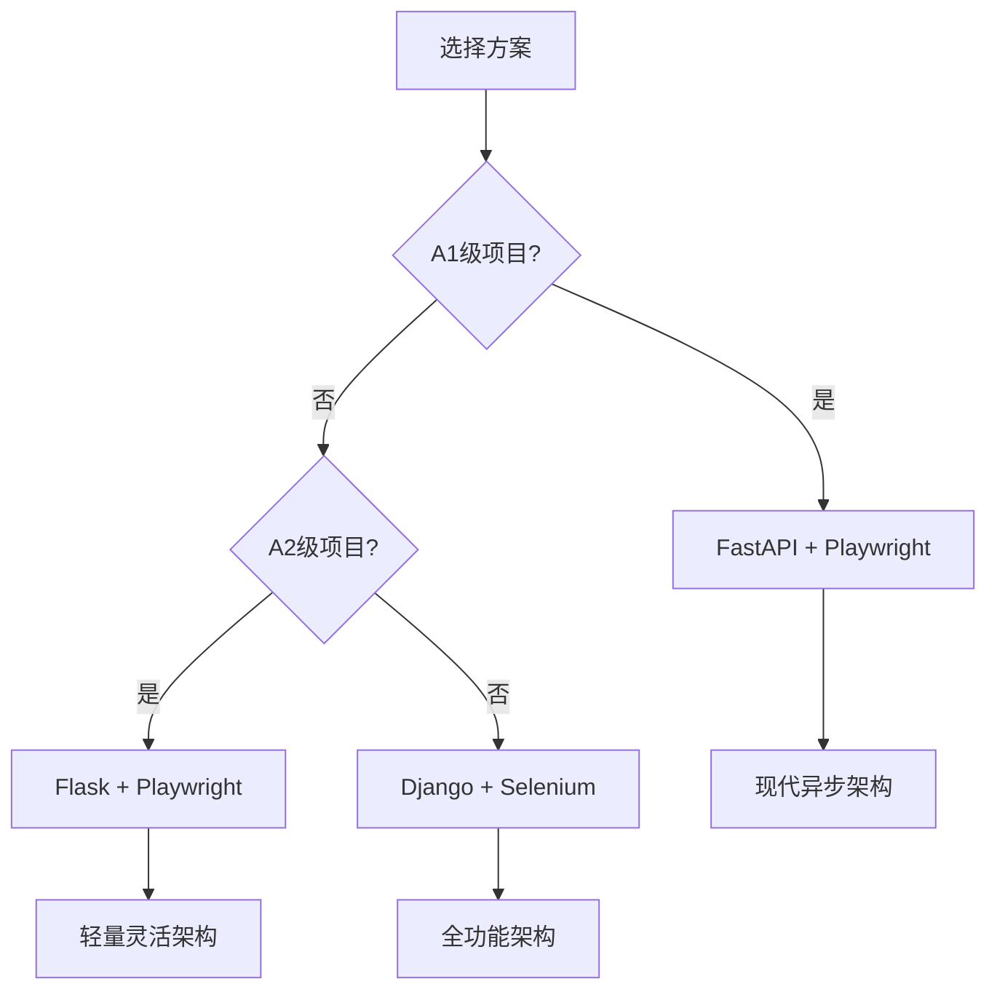
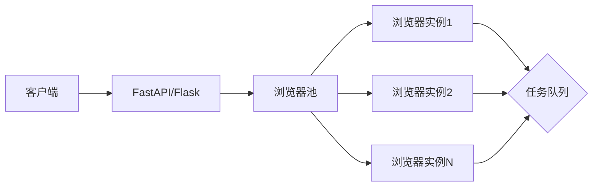

# Python后端框架与指纹浏览器集成实战

> 📚 本文详细介绍Python后端与指纹浏览器的多种集成方案，包括代码示例和Docker打包配置。

## 目录

1. [指纹浏览器简介](#1-指纹浏览器简介)
2. [技术选型](#2-技术选型)
3. [Playwright + FastAPI 集成方案](#3-playwright--fastapi-集成方案)
4. [Selenium + Flask 集成方案](#4-selenium--flask-集成方案)
5. [Docker打包完整示例](#5-docker打包完整示例)
6. [常见问题与解决方案](#6-常见问题与解决方案)
7. [最佳实践](#7-最佳实践)

---

## 1. 指纹浏览器简介

### 1.1 什么是指纹浏览器？

指纹浏览器通过修改浏览器指纹参数（如User-Agent、Canvas、WebGL、时区等）来隐藏真实身份，防止被网站识别和封禁。

### 1.2 常见的指纹浏览器工具

| 工具 | 语言绑定 | 特点 | 适用场景 |
|------|---------|------|---------|
| **Playwright** | Python/JS | 微软出品、功能强大、速度快 | 现代Web自动化 |
| **Selenium** | 多语言 | 生态成熟、支持多浏览器 | 兼容性要求高 |
| **Puppeteer** | JS/TS | Chrome原生、性能好 | Node.js项目 |
| **DrissionPage** | Python | 国产、轻量、简洁 | 快速开发 |
| **undetected-chromedriver** | Python | 反检测能力强 | 爬虫场景 |

### 1.3 工作原理

```
┌─────────────────────────────────────────┐
│         普通浏览器访问                    │
├─────────────────────────────────────────┤
│ User-Agent: Chrome 120                  │
│ Canvas: 真实指纹                         │
│ WebGL: 真实显卡信息                      │
│ 时区: 本地时区                           │
│ → 容易被识别和封禁 ❌                     │
└─────────────────────────────────────────┘

                    ↓ 指纹浏览器 ↓

┌─────────────────────────────────────────┐
│         指纹浏览器访问                    │
├─────────────────────────────────────────┤
│ User-Agent: 自定义/随机                 │
│ Canvas: 伪造指纹                         │
│ WebGL: 隐藏/伪造                        │
│ 时区: 代理服务器时区                     │
│ → 难以被识别 ✅                          │
└─────────────────────────────────────────┘
```

---

## 2. 技术选型

### 2.1 后端框架对比

| 框架 | 特点 | 异步支持 | 学习曲线 | 推荐场景 |
|------|------|---------|---------|---------|
| **FastAPI** | 高性能、自动文档、类型提示 | ✅ 完整异步 | ⭐⭐ | API服务、微服务 |
| **Flask** | 轻量、灵活、扩展丰富 | ⚠️ 部分异步 | ⭐⭐ | 中小型项目 |
| **Django** | 全功能、ORM、管理后台 | ❌ 同步 | ⭐⭐⭐ | 大型Web应用 |

### 2.2 推荐组合



### 2.3 本教程方案

我们采用**FastAPI + Playwright**作为主要方案，因为：
- ✅ 完整的异步支持，性能最优
- ✅ 自动API文档，方便调试
- ✅ Playwright现代、功能强大
- ✅ 打包镜像相对较小

---

## 3. Playwright + FastAPI 集成方案

### 3.1 项目结构

```
playwright_fastapi/
├── app/
│   ├── __init__.py
│   ├── main.py              # FastAPI主应用
│   ├── browser.py           # 浏览器管理
│   ├── routes/
│   │   ├── __init__.py
│   │   ├── scrape.py        # 爬虫相关路由
│   │   └── screenshot.py     # 截图相关路由
│   └── utils/
│       ├── __init__.py
│       └── fingerprint.py   # 指纹配置
├── Dockerfile
├── docker-compose.yml
├── requirements.txt
└── README.md
```

### 3.2 依赖文件

```txt
# requirements.txt
fastapi==0.109.0
uvicorn[standard]==0.27.0
playwright==1.40.0
python-multipart==0.0.6
pydantic==2.5.3
httpx==0.26.0
```

### 3.3 浏览器管理模块

```python
# app/browser.py
from playwright.async_api import async_playwright, Browser, BrowserContext
from typing import Optional
import asyncio

class BrowserManager:
    """浏览器管理器"""

    def __init__(self):
        self.playwright = None
        self.browser: Optional[Browser] = None
        self.contexts: list[BrowserContext] = []

    async def init(self):
        """初始化Playwright"""
        if self.playwright is None:
            self.playwright = await async_playwright().start()
            # 启动Chromium（支持Linux无头模式）
            self.browser = await self.playwright.chromium.launch(
                headless=True,  # Docker中必须为True
                args=[
                    '--no-sandbox',                    # Docker必需
                    '--disable-setuid-sandbox',        # Docker必需
                    '--disable-dev-shm-usage',        # 避免共享内存问题
                    '--disable-blink-features=AutomationControlled',  # 反检测
                ]
            )
            print("✅ Playwright浏览器初始化完成")

    async def create_context(self, fingerprint: dict = None):
        """创建浏览器上下文（带指纹）"""
        if self.browser is None:
            await self.init()

        # 默认指纹配置
        default_fingerprint = {
            'user_agent': 'Mozilla/5.0 (Windows NT 10.0; Win64; x64) AppleWebKit/537.36 (KHTML, like Gecko) Chrome/120.0.0.0 Safari/537.36',
            'viewport': {'width': 1920, 'height': 1080},
            'locale': 'zh-CN',
            'timezone_id': 'Asia/Shanghai',
            'geolocation': {'latitude': 39.9042, 'longitude': 116.4074},
            'permissions': ['geolocation'],
        }

        if fingerprint:
            default_fingerprint.update(fingerprint)

        context = await self.browser.new_context(
            user_agent=default_fingerprint.get('user_agent'),
            viewport=default_fingerprint.get('viewport'),
            locale=default_fingerprint.get('locale'),
            timezone_id=default_fingerprint.get('timezone_id'),
            geolocation=default_fingerprint.get('geolocation'),
            permissions=default_fingerprint.get('permissions'),
        )

        self.contexts.append(context)
        return context

    async def close_context(self, context: BrowserContext):
        """关闭浏览器上下文"""
        if context in self.contexts:
            self.contexts.remove(context)
        await context.close()

    async def cleanup(self):
        """清理所有资源"""
        for context in self.contexts:
            try:
                await context.close()
            except:
                pass

        if self.browser:
            await self.browser.close()

        if self.playwright:
            await self.playwright.stop()

        print("🧹 浏览器资源已清理")


# 全局浏览器管理器实例
browser_manager = BrowserManager()
```

### 3.4 FastAPI主应用

```python
# app/main.py
from fastapi import FastAPI
from contextlib import asynccontextmanager
from app.browser import browser_manager
from app.routes import scrape, screenshot

@asynccontextmanager
async def lifespan(app: FastAPI):
    """应用生命周期管理"""
    # 启动时初始化浏览器
    await browser_manager.init()
    print("🚀 应用启动，浏览器已就绪")

    yield

    # 关闭时清理浏览器
    await browser_manager.cleanup()
    print("👋 应用关闭，资源已清理")

app = FastAPI(
    title="指纹浏览器API服务",
    description="基于Playwright的指纹浏览器自动化服务",
    version="1.0.0",
    lifespan=lifespan
)

# 注册路由
app.include_router(scrape.router, prefix="/api/scrape", tags=["爬虫"])
app.include_router(screenshot.router, prefix="/api/screenshot", tags=["截图"])

@app.get("/")
async def root():
    return {"message": "指纹浏览器API服务", "status": "running"}

@app.get("/health")
async def health():
    return {"status": "healthy", "browsers": len(browser_manager.contexts)}
```

### 3.5 爬虫路由

```python
# app/routes/scrape.py
from fastapi import APIRouter, HTTPException
from pydantic import BaseModel
from typing import Optional
from app.browser import browser_manager

router = APIRouter()

class ScrapeRequest(BaseModel):
    url: str
    fingerprint: Optional[dict] = None
    wait_until: str = "networkidle"  # load, domcontentloaded, networkidle

class ScrapeResponse(BaseModel):
    url: str
    title: str
    content: str
    screenshot: Optional[str] = None

@router.post("/scrape", response_model=ScrapeResponse)
async def scrape_page(request: ScrapeRequest):
    """
    抓取网页内容
    """
    context = None
    page = None

    try:
        # 创建带指纹的浏览器上下文
        context = await browser_manager.create_context(request.fingerprint)
        page = await context.new_page()

        # 访问页面
        await page.goto(request.url, wait_until=request.wait_until, timeout=30000)

        # 获取页面内容
        title = await page.title()
        content = await page.content()

        return ScrapeResponse(
            url=request.url,
            title=title,
            content=content
        )

    except Exception as e:
        raise HTTPException(status_code=500, detail=f"抓取失败: {str(e)}")

    finally:
        if page:
            await page.close()
        if context:
            await browser_manager.close_context(context)
```

### 3.6 截图路由

```python
# app/routes/screenshot.py
from fastapi import APIRouter, HTTPException
from pydantic import BaseModel
from typing import Optional
import base64
from app.browser import browser_manager

router = APIRouter()

class ScreenshotRequest(BaseModel):
    url: str
    fingerprint: Optional[dict] = None
    full_page: bool = False  # 是否截取整页

class ScreenshotResponse(BaseModel):
    url: str
    screenshot: str  # Base64编码的图片

@router.post("/screenshot", response_model=ScreenshotResponse)
async def take_screenshot(request: ScreenshotRequest):
    """
    获取网页截图
    """
    context = None
    page = None

    try:
        context = await browser_manager.create_context(request.fingerprint)
        page = await context.new_page()

        await page.goto(request.url, wait_until="load", timeout=30000)

        # 截图
        screenshot_bytes = await page.screenshot(full_page=request.full_page)
        screenshot_base64 = base64.b64encode(screenshot_bytes).decode('utf-8')

        return ScreenshotResponse(
            url=request.url,
            screenshot=screenshot_base64
        )

    except Exception as e:
        raise HTTPException(status_code=500, detail=f"截图失败: {str(e)}")

    finally:
        if page:
            await page.close()
        if context:
            await browser_manager.close_context(context)
```

### 3.7 运行服务

```bash
# 安装依赖
pip install -r requirements.txt

# 安装Playwright浏览器
playwright install chromium

# 运行服务
uvicorn app.main:app --host 0.0.0.0 --port 8000 --reload
```

---

## 4. Selenium + Flask 集成方案

### 4.1 项目结构

```
selenium_flask/
├── app/
│   ├── __init__.py
│   ├── app.py              # Flask主应用
│   ├── browser.py          # 浏览器配置
│   └── routes/
│       ├── __init__.py
│       └── scrape.py
├── Dockerfile
├── requirements.txt
└── chromedriver/           # 浏览器驱动
```

### 4.2 依赖文件

```txt
# requirements.txt
flask==3.0.0
selenium==4.16.0
webdriver-manager==4.0.1
undetected-chromedriver==3.5.4
flask-cors==4.0.0
gunicorn==21.2.0
```

### 4.3 浏览器配置

```python
# app/browser.py
from selenium import webdriver
from selenium.webdriver.chrome.options import Options
from selenium.webdriver.chrome.service import Service
from webdriver_manager.chrome import ChromeDriverManager
import undetected_chromedriver as uc
from typing import Optional

def create_driver(headless: bool = True) -> webdriver.Chrome:
    """创建带指纹的Chrome浏览器"""

    # 方法1：使用undetected_chromedriver（反检测更强）
    options = uc.ChromeOptions()
    options.headless = headless
    options.add_argument('--no-sandbox')
    options.add_argument('--disable-dev-shm-usage')

    # 随机User-Agent
    options.add_argument('--user-agent=Mozilla/5.0 (Windows NT 10.0; Win64; x64) AppleWebKit/537.36')

    driver = uc.Chrome(options=options, version_main=120)
    return driver

def create_driver_with_fingerprint(headless: bool = True, proxy: str = None) -> webdriver.Chrome:
    """创建带指纹和代理的浏览器"""

    options = Options()

    if headless:
        options.add_argument('--headless=new')

    # 基础参数
    options.add_argument('--no-sandbox')
    options.add_argument('--disable-dev-shm-usage')
    options.add_argument('--disable-gpu')

    # 反检测参数
    options.add_argument('--disable-blink-features=AutomationControlled')
    options.add_experimental_option('excludeSwitches', ['enable-automation'])
    options.add_experimental_option('useAutomationExtension', False)

    # 自定义User-Agent
    options.add_argument('--user-agent=Mozilla/5.0 (Windows NT 10.0; Win64; x64) AppleWebKit/537.36 (KHTML, like Gecko) Chrome/120.0.0.0 Safari/537.36')

    # 代理（如果有）
    if proxy:
        options.add_argument(f'--proxy-server={proxy}')

    # 创建驱动
    service = Service(ChromeDriverManager().install())
    driver = webdriver.Chrome(service=service, options=options)

    # 执行反检测脚本
    driver.execute_cdp_cmd('Page.addScriptToEvaluateOnNewDocument', {
        'source': '''
            Object.defineProperty(navigator, 'webdriver', {
                get: () => undefined
            });
        '''
    })

    return driver
```

### 4.4 Flask应用

```python
# app/app.py
from flask import Flask, request, jsonify
from flask_cors import CORS
from app.browser import create_driver_with_fingerprint
import time

app = Flask(__name__)
CORS(app)  # 允许跨域

# 浏览器驱动（全局单例）
driver = None

def get_driver():
    global driver
    if driver is None:
        driver = create_driver_with_fingerprint(headless=True)
    return driver

@app.route('/api/scrape', methods=['POST'])
def scrape():
    """抓取网页"""
    data = request.json
    url = data.get('url')

    if not url:
        return jsonify({'error': 'URL is required'}), 400

    try:
        browser = get_driver()
        browser.get(url)
        time.sleep(2)  # 等待页面加载

        title = browser.title
        page_source = browser.page_source

        return jsonify({
            'url': url,
            'title': title,
            'content': page_source
        })

    except Exception as e:
        return jsonify({'error': str(e)}), 500

@app.route('/api/screenshot', methods=['POST'])
def screenshot():
    """截图"""
    data = request.json
    url = data.get('url')

    if not url:
        return jsonify({'error': 'URL is required'}), 400

    try:
        browser = get_driver()
        browser.get(url)
        time.sleep(2)

        # 截图保存
        screenshot_path = '/tmp/screenshot.png'
        browser.save_screenshot(screenshot_path)

        with open(screenshot_path, 'rb') as f:
            import base64
            screenshot_base64 = base64.b64encode(f.read()).decode('utf-8')

        return jsonify({
            'url': url,
            'screenshot': screenshot_base64
        })

    except Exception as e:
        return jsonify({'error': str(e)}), 500

@app.route('/api/close', methods=['POST'])
def close_browser():
    """关闭浏览器"""
    global driver
    if driver:
        driver.quit()
        driver = None
    return jsonify({'message': 'Browser closed'})

@app.route('/health')
def health():
    return jsonify({'status': 'healthy'})

if __name__ == '__main__':
    app.run(host='0.0.0.0', port=5000, debug=True)
```

---

## 5. Docker打包完整示例

### 5.1 FastAPI + Playwright Dockerfile

```dockerfile
# Dockerfile for FastAPI + Playwright
FROM python:3.11-slim

# 设置工作目录
WORKDIR /app

# 安装系统依赖（Playwright必需）
RUN apt-get update && apt-get install -y \
    wget \
    gnupg \
    ca-certificates \
    fonts-liberation \
    libasound2 \
    libatk-bridge2.0-0 \
    libatk1.0-0 \
    libcups2 \
    libdbus-1-3 \
    libdrm2 \
    libgbm1 \
    libgtk-3-0 \
    libnspr4 \
    libnss3 \
    libx11-xcb1 \
    libxcomposite1 \
    libxdamage1 \
    libxrandr2 \
    xdg-utils \
    && rm -rf /var/lib/apt/lists/*

# 复制依赖文件
COPY requirements.txt .

# 安装Python依赖
RUN pip install --no-cache-dir -r requirements.txt

# 安装Playwright浏览器
RUN playwright install chromium --with-deps

# 复制应用代码
COPY app/ ./app/

# 暴露端口
EXPOSE 8000

# 运行命令
CMD ["uvicorn", "app.main:app", "--host", "0.0.0.0", "--port", "8000"]
```

### 5.2 docker-compose.yml

```yaml
version: '3.8'

services:
  browser-api:
    build:
      context: .
      dockerfile: Dockerfile
    container_name: browser-api
    ports:
      - "8000:8000"
    environment:
      - TZ=Asia/Shanghai
    volumes:
      - ./logs:/app/logs
    restart: unless-stopped
    healthcheck:
      test: ["CMD", "curl", "-f", "http://localhost:8000/health"]
      interval: 30s
      timeout: 10s
      retries: 3

  # 可选：添加代理服务
  proxy:
    image: hafsa/Cloudflare-Stable
    container_name: proxy
    ports:
      - "7890:7890"
      - "7891:7891"
    environment:
      - TZ=Asia/Shanghai
    restart: unless-stopped
```

### 5.3 启动服务

```bash
# 构建并启动
docker-compose up -d --build

# 查看日志
docker-compose logs -f browser-api

# 停止服务
docker-compose down
```

---

## 6. 常见问题与解决方案

### 6.1 Docker中浏览器无法启动

**问题**：在Docker容器中运行Playwright/Selenium时浏览器无法启动。

**解决方案**：
```dockerfile
# 安装浏览器必需的依赖
RUN playwright install --with-deps chromium

# 或者在Dockerfile中添加
RUN apt-get update && apt-get install -y \
    fonts-liberation \
    libasound2 \
    libatk-bridge2.0-0 \
    libatk1.0-0 \
    libcups2 \
    libdrm2 \
    libgbm1 \
    libgtk-3-0 \
    libnspr4 \
    libnss3 \
    libx11-xcb1 \
    libxcomposite1 \
    libxdamage1 \
    libxrandr2
```

### 6.2 内存不足

**问题**：浏览器占用内存过大，导致容器崩溃。

**解决方案**：
```python
# 限制浏览器内存使用
browser = await playwright.chromium.launch(
    args=[
        '--disable-dev-shm-usage',  # 使用/tmp代替/dev/shm
        '--js-flags=--max-old-space-size=4096'  # 限制JS堆内存
    ]
)

# 及时关闭页面
async def close_page(page):
    await page.close()
    await page.context.close()
```

### 6.3 被网站检测为机器人

**问题**：即使使用指纹浏览器，仍被检测。

**解决方案**：
```python
# 1. 使用undetected-chromedriver
import undetected_chromedriver as uc
driver = uc.Chrome()

# 2. 添加更多反检测参数
options.add_argument('--disable-blink-features=AutomationControlled')
options.add_experimental_option('excludeSwitches', ['enable-automation'])

# 3. 随机化指纹
import random
user_agents = [...]
options.add_argument(f'--user-agent={random.choice(user_agents)}')
```

### 6.4 代理IP被封

**问题**：代理IP使用频繁后被封。

**解决方案**：
```python
# 1. 轮换使用多个代理
proxies = ['proxy1:port', 'proxy2:port', 'proxy3:port']

# 2. 降低请求频率
import asyncio
await asyncio.sleep(random.uniform(3, 8))

# 3. 失败后自动切换代理
async def get_with_proxy_fallback(url, max_retries=3):
    for proxy in proxies:
        try:
            context = await browser.new_context(proxy={'server': proxy})
            page = await context.new_page()
            await page.goto(url)
            return page
        except:
            continue
    raise Exception("所有代理均失败")
```

---

## 7. 最佳实践

### 7.1 架构设计



### 7.2 浏览器池实现

```python
# 浏览器池管理器
import asyncio
from typing import Optional

class BrowserPool:
    def __init__(self, pool_size: int = 3):
        self.pool_size = pool_size
        self.browsers = asyncio.Queue()
        self.available = 0

    async def acquire(self):
        """获取浏览器实例"""
        if not self.browsers.empty():
            return await self.browsers.get()

        if self.available < self.pool_size:
            self.available += 1
            # 创建新浏览器
            browser = await create_browser()
            return browser

        # 等待可用浏览器
        return await self.browsers.get()

    async def release(self, browser):
        """归还浏览器"""
        await self.browsers.put(browser)

    async def close_all(self):
        """关闭所有浏览器"""
        while not self.browsers.empty():
            browser = await self.browsers.get()
            await browser.close()
```

### 7.3 性能优化

| 优化项 | 方法 |
|--------|------|
| **并发控制** | 使用asyncio Semaphore限制并发数 |
| **浏览器复用** | 使用浏览器池，避免频繁创建销毁 |
| **资源清理** | 使用上下文管理器，确保资源释放 |
| **内存控制** | 限制页面数量，及时关闭不需要的页面 |
| **请求限流** | 添加延迟，避免触发反爬机制 |

### 7.4 安全建议

1. ✅ **隔离运行**：Docker容器中运行，与主机隔离
2. ✅ **资源限制**：设置CPU和内存限制
3. ✅ **日志脱敏**：不要记录敏感URL或数据
4. ✅ **定期更新**：更新浏览器版本，修复漏洞
5. ✅ **监控告警**：监控浏览器进程，及时处理异常

### 7.5 一键部署脚本

```bash
#!/bin/bash
# deploy.sh

set -e

echo "🚀 开始部署指纹浏览器服务..."

# 1. 构建镜像
echo "📦 构建Docker镜像..."
docker build -t browser-api:latest .

# 2. 停止旧容器
echo "⏹️  停止旧容器..."
docker-compose down || true

# 3. 启动新容器
echo "▶️  启动服务..."
docker-compose up -d

# 4. 等待服务就绪
echo "⏳ 等待服务就绪..."
sleep 10

# 5. 健康检查
echo "🔍 健康检查..."
for i in {1..10}; do
    if curl -f http://localhost:8000/health > /dev/null 2>&1; then
        echo "✅ 服务部署成功！"
        echo "📍 访问地址: http://localhost:8000"
        echo "📖 API文档: http://localhost:8000/docs"
        exit 0
    fi
    echo "等待服务启动... ($i/10)"
    sleep 3
done

echo "❌ 部署失败，请检查日志"
docker-compose logs
exit 1
```

---

## 📚 相关资源

- [Playwright官方文档](https://playwright.dev/python/)
- [Selenium官方文档](https://www.selenium.dev/documentation/)
- [undetected-chromedriver](https://github.com/ultrafunkamsterdam/undetected-chromedriver)
- [Docker官方文档](https://docs.docker.com/)

---

**📅 文章信息**：
- 作者：母亚含
- 发表日期：2026-08-12
- 阅读量：0

**🏷️ 标签**：`Python` `FastAPI` `Flask` `Playwright` `Selenium` `指纹浏览器` `Docker`
