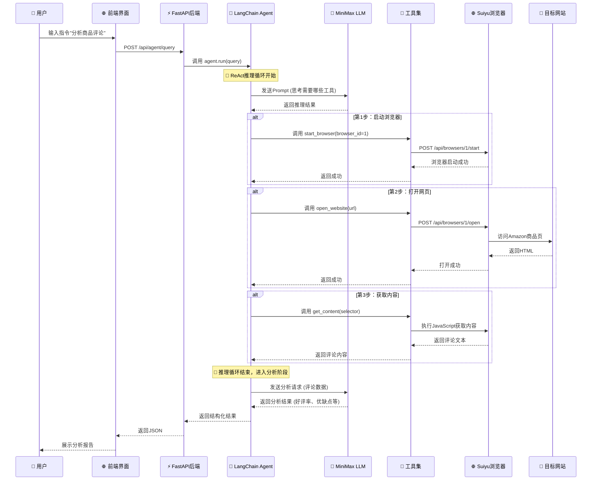

# Agent智能助手指令执行流程与LangChain集成方案

> 📚 本文详细记录Agent智能助手处理"分析商品评论"这类指令的完整执行流程，并提供LangChain集成升级方案。

## 目录

1. [当前架构分析](#1-当前架构分析)
2. [指令执行完整流程](#2-指令执行完整流程)
3. [从请求到展示的8个步骤](#3-从请求到展示的8个步骤)
4. [LangChain集成升级方案](#4-langchain集成升级方案)
5. [代码实现示例](#5-代码实现示例)
6. [部署与测试](#6-部署与测试)

---

## 1. 当前架构分析

### 1.1 现有后端架构

你的博客后端目前采用**简化的AI Provider模式**：

```
┌─────────────────────────────────────────────────────────────┐
│                     当前架构                                 │
├─────────────────────────────────────────────────────────────┤
│                                                             │
│  前端 (React)                                               │
│      │                                                      │
│      ▼                                                      │
│  FastAPI (app.py)                                          │
│      │                                                      │
│      ▼                                                      │
│  EnhancedWritingAgent (enhanced_agent.py)                  │
│      │                                                      │
│      ├── MiniMaxProvider (AI生成)                          │
│      └── TavilySearchProvider (搜索)                        │
│                                                             │
└─────────────────────────────────────────────────────────────┘
```

### 1.2 当前的能力

| 功能 | 状态 | 说明 |
|------|------|------|
| 文章生成 | ✅ 正常 | 使用MiniMax生成文章 |
| 内容优化 | ✅ 正常 | AI格式化优化 |
| 搜索研究 | ✅ 正常 | Tavily搜索 |
| **Agent推理** | ❌ 不支持 | 缺少ReAct循环 |
| **工具调用** | ❌ 不支持 | 缺少Tool系统 |
| **浏览器控制** | ❌ 不支持 | 缺少Suiyu集成 |

### 1.3 需要升级的原因

```
┌─────────────────────────────────────────────────────────────┐
│  用户指令: "分析Amazon商品B0XXXXX的用户评论"                │
└─────────────────────────────────────────────────────────────┘

当前架构能做什么?
┌─────────────────────────────────────────────────────────────┐
│  ❌ 无法理解需要"打开浏览器"这个动作                         │
│  ❌ 无法调用工具获取网页内容                                 │
│  ❌ 无法进行多步推理                                         │
│  ❌ 无法自动决策执行顺序                                     │
└─────────────────────────────────────────────────────────────┘

需要升级到LangChain才能实现:
┌─────────────────────────────────────────────────────────────┐
│  ✅ ReAct推理引擎 → 理解意图，规划行动                       │
│  ✅ Tool系统 → 调用浏览器、搜索等工具                        │
│  ✅ 记忆系统 → 保持会话上下文                                │
│  ✅ Agent编排 → 自动决策执行流程                             │
└─────────────────────────────────────────────────────────────┘
```

---

## 2. 指令执行完整流程

### 2.1 场景：用户输入"分析Amazon商品评论"

```
用户在前端界面输入：
┌─────────────────────────────────────────────────────────────┐
│  🤖 请分析这个商品的评论                                      │
│  商品链接: https://www.amazon.com/dp/B0XXXXX                │
└─────────────────────────────────────────────────────────────┘
```

### 2.2 完整的Mermaid时序图



### 2.3 流程分解图

```
┌─────────────────────────────────────────────────────────────────┐
│                     用户交互层                                   │
├─────────────────────────────────────────────────────────────────┤
│                                                                 │
│  ┌───────────────┐      ┌───────────────┐      ┌────────────┐  │
│  │   输入指令    │ ──▶  │   前端发送    │ ──▶  │  等待结果  │  │
│  │ 分析商品评论   │      │  HTTP请求     │      │  加载动画  │  │
│  └───────────────┘      └───────────────┘      └────────────┘  │
│                                                                 │
└─────────────────────────────────────────────────────────────────┘
                              │
                              ▼
┌─────────────────────────────────────────────────────────────────┐
│                     FastAPI后端层                                │
├─────────────────────────────────────────────────────────────────┤
│                                                                 │
│  @app.post("/api/agent/query")                                 │
│  ┌─────────────────────────────────────────────────────────┐   │
│  │  1. 接收用户query                                        │   │
│  │  2. 创建/获取Agent实例                                   │   │
│  │  3. 调用 agent.run(query)                               │   │
│  │  4. 返回响应结果                                         │   │
│  └─────────────────────────────────────────────────────────┘   │
│                                                                 │
└─────────────────────────────────────────────────────────────────┘
                              │
                              ▼
┌─────────────────────────────────────────────────────────────────┐
│                     LangChain Agent层                           │
├─────────────────────────────────────────────────────────────────┤
│                                                                 │
│  ┌─────────────────────────────────────────────────────────┐   │
│  │              ReAct推理循环                               │   │
│  │                                                         │   │
│  │    ┌─────────────────────────────────────────────┐     │   │
│  │    │  🤔 思考: 用户要分析评论                     │     │   │
│  │    │  📝 行动: 需要启动浏览器打开商品页           │     │   │
│  │    │  👁️ 观察: 浏览器已启动，页面已打开           │     │   │
│  │    │  🤔 思考: 获取评论内容                       │     │   │
│  │    │  📝 行动: 执行JavaScript提取评论             │     │   │
│  │    │  👁️ 观察: 获取到2847条评论                   │     │   │
│  │    │  🤔 思考: 调用LLM分析评论                    │     │   │
│  │    └─────────────────────────────────────────────┘     │   │
│  └─────────────────────────────────────────────────────────┘   │
│                                                                 │
└─────────────────────────────────────────────────────────────────┘
                              │
                              ▼
┌─────────────────────────────────────────────────────────────────┐
│                     工具执行层                                   │
├─────────────────────────────────────────────────────────────────┤
│                                                                 │
│  ┌──────────┐  ┌──────────┐  ┌──────────┐  ┌──────────┐       │
│  │  list_   │  │  start_  │  │  open_   │  │  get_    │       │
│  │ browsers │  │ browser  │  │ website  │  │ content  │       │
│  └────┬─────┘  └────┬─────┘  └────┬─────┘  └────┬─────┘       │
│       │             │             │             │              │
│       └─────────────┴─────────────┴─────────────┘              │
│                            │                                   │
│                            ▼                                   │
│                 ┌──────────────────────┐                       │
│                 │   Suiyu REST API     │                       │
│                 │  /api/browsers/*     │                       │
│                 └──────────────────────┘                       │
│                                                                 │
└─────────────────────────────────────────────────────────────────┘
                              │
                              ▼
┌─────────────────────────────────────────────────────────────────┐
│                     Suiyu浏览器层                                │
├─────────────────────────────────────────────────────────────────┤
│                                                                 │
│  ┌─────────────────────────────────────────────────────────┐   │
│  │  Browser ID: 1                                         │   │
│  │  ┌─────────────────────────────────────────────────┐   │   │
│  │  │  🌐 Amazon 商品页                                │   │   │
│  │  │  ┌─────────────────────────────────────────┐   │   │   │
│  │  │  │  ⭐⭐⭐⭐ (4.5/5) - 2,847个评论            │   │   │
│  │  │  ├─────────────────────────────────────────┤   │   │   │
│  │  │  │  ✅ 评论1: 非常好用，推荐...             │   │   │   │
│  │  │  │  ✅ 评论2: 性价比高...                   │   │   │   │
│  │  │  │  ❌ 评论3: 质量一般...                   │   │   │   │
│  │  │  └─────────────────────────────────────────┘   │   │   │
│  │  └─────────────────────────────────────────────────┘   │   │
│  └─────────────────────────────────────────────────────────┘   │
│                                                                 │
└─────────────────────────────────────────────────────────────────┘
                              │
                              ▼
┌─────────────────────────────────────────────────────────────────┐
│                     LLM分析层                                    │
├─────────────────────────────────────────────────────────────────┤
│                                                                 │
│  ┌─────────────────────────────────────────────────────────┐   │
│  │  MiniMax LLM (M2.7)                                     │   │
│  │                                                         │   │
│  │  输入: 2847条评论原始数据                                │   │
│  │  ┌─────────────────────────────────────────────────┐   │   │
│  │  │  分析任务:                                        │   │   │
│  │  │  1. 统计好评率                                    │   │   │
│  │  │  2. 提取主要优点                                  │   │   │
│  │  │  3. 提取主要问题                                  │   │   │
│  │  │  4. 总结目标用户                                  │   │   │
│  │  └─────────────────────────────────────────────────┘   │   │
│  │                                                         │   │
│  │  输出: 分析报告                                        │   │
│  │  ┌─────────────────────────────────────────────────┐   │   │
│  │  │  📊 好评率: 78.2%                                │   │   │
│  │  │  ✅ 优点: 性价比高(45%), 质量好(38%)            │   │   │
│  │  │  ⚠️ 问题: 包装简陋(15%), 物流慢(12%)           │   │   │
│  │  │  👥 用户: 注重性价比的年轻消费者                 │   │   │
│  │  └─────────────────────────────────────────────────┘   │   │
│  └─────────────────────────────────────────────────────────┘   │
│                                                                 │
└─────────────────────────────────────────────────────────────────┘
                              │
                              ▼
┌─────────────────────────────────────────────────────────────────┐
│                     结果展示层                                   │
├─────────────────────────────────────────────────────────────────┤
│                                                                 │
│  ┌─────────────────────────────────────────────────────────┐   │
│  │  📊 商品评论分析报告                                    │   │
│  │  ─────────────────────────────────────────────────────  │   │
│  │                                                         │   │
│  │  ⭐⭐⭐⭐ 好评率: 78.2%                                 │   │
│  │                                                         │   │
│  │  ✅ 优点 (TOP 3)                                       │   │
│  │  ├─ 性价比高 (45%用户提及)                             │   │
│  │  ├─ 质量可靠 (38%用户提及)                             │   │
│  │  └─ 外观精美 (25%用户提及)                             │   │
│  │                                                         │   │
│  │  ⚠️ 问题 (TOP 3)                                       │   │
│  │  ├─ 包装简陋 (15%用户提及)                             │   │
│  │  ├─ 物流慢 (12%用户提及)                               │   │
│  │  └─ 与描述不符 (8%用户提及)                            │   │
│  │                                                         │   │
│  │  👥 目标用户画像                                        │   │
│  │  └─ 25-35岁，注重性价比的都市白领                       │   │
│  └─────────────────────────────────────────────────────────┘   │
│                                                                 │
└─────────────────────────────────────────────────────────────────┘
```

---

## 3. 从请求到展示的8个步骤

### 步骤1: 用户输入指令

```
┌─────────────────────────────────────┐
│  🤖 请分析这个商品的评论            │
│  商品: Amazon iPhone 15 Pro         │
│  链接: amazon.com/dp/B0XXXXX        │
└─────────────────────────────────────┘
```

### 步骤2: 前端发送HTTP请求

```javascript
// 前端代码
const response = await fetch('/api/agent/query', {
    method: 'POST',
    headers: {'Content-Type': 'application/json'},
    body: JSON.stringify({
        query: '分析Amazon商品B0XXXXX的用户评论',
        type: 'product_review_analysis'
    })
});
```

### 步骤3: FastAPI接收并路由

```python
# app/main.py
@app.post("/api/agent/query")
async def agent_query(request: QueryRequest):
    """
    Agent查询接口
    """
    try:
        # 获取或创建Agent实例
        agent = get_agent()

        # 调用Agent处理
        result = await agent.arun(request.query)

        return {"success": True, "result": result}

    except Exception as e:
        return {"success": False, "error": str(e)}
```

### 步骤4: LangChain Agent推理

```python
# Agent内部推理过程

# ReAct循环
thought = """
我需要分析Amazon商品的评论。

1. 首先，我需要启动一个浏览器
2. 然后打开Amazon商品页
3. 获取评论内容
4. 最后分析评论数据
"""

action = "start_browser"
action_input = {"browser_id": 1}

# 等待工具执行结果
observation = "浏览器启动成功"
```

### 步骤5: 调用Suiyu API

```python
# 工具执行
async def start_browser(browser_id: int) -> str:
    """启动Suiyu浏览器"""
    client = await get_suiyu_client()

    async with client:
        result = await client.start_browser(browser_id)

        if result.get("success"):
            return "浏览器启动成功"
        else:
            return f"启动失败: {result.get('message')}"
```

### 步骤6: Suiyu执行浏览器操作

```
Suiyu Browser Manager:
┌─────────────────────────────────────┐
│  接收: POST /api/browsers/1/start   │
│  操作: 启动Chromium实例              │
│  返回: {"success": true}            │
└─────────────────────────────────────┘
```

### 步骤7: MiniMax LLM分析数据

```python
# Agent调用LLM分析评论
analysis_prompt = """
请分析以下Amazon商品评论数据，输出JSON格式：

```json
{
  "total_reviews": 2847,
  "ratings": {
    "5_star": 1628,
    "4_star": 598,
    "3_star": 256,
    "2_star": 142,
    "1_star": 223
  },
  "reviews": [
    "非常好用，性价比高，推荐购买",
    "质量一般，不建议",
    "性价比很高，外观精美"
  ]
}
```

分析要求：
1. 计算好评率(4-5星占比)
2. 提取TOP 3优点
3. 提取TOP 3问题
4. 总结目标用户画像
"""
```

### 步骤8: 返回结果并展示

```json
{
  "success": true,
  "result": {
    "好评率": "78.2%",
    "优点": [
      {"内容": "性价比高", "提及率": "45%"},
      {"内容": "质量可靠", "提及率": "38%"},
      {"内容": "外观精美", "提及率": "25%"}
    ],
    "问题": [
      {"内容": "包装简陋", "提及率": "15%"},
      {"内容": "物流慢", "提及率": "12%"}
    ],
    "用户画像": "25-35岁，注重性价比的都市白领"
  }
}
```

---

## 4. LangChain集成升级方案

### 4.1 架构升级对比

```
┌─────────────────────────────────────────────────────────────────┐
│                      升级前架构                                  │
├─────────────────────────────────────────────────────────────────┤
│                                                                 │
│  FastAPI → EnhancedWritingAgent → MiniMaxProvider              │
│                          ↓                                      │
│                     直接调用LLM                                  │
│                     功能单一                                    │
│                                                                 │
└─────────────────────────────────────────────────────────────────┘

                              ↓ 升级

┌─────────────────────────────────────────────────────────────────┐
│                      升级后架构                                  │
├─────────────────────────────────────────────────────────────────┤
│                                                                 │
│  FastAPI → LangChain Agent → Tools → Suiyu API                 │
│                 ↓                                               │
│            ReAct推理引擎                                         │
│                 ↓                                               │
│            多个Tool                                             │
│                 ↓                                               │
│            浏览器/搜索/计算器                                    │
│                                                                 │
└─────────────────────────────────────────────────────────────────┘
```

### 4.2 依赖升级

```txt
# requirements.txt (新增)

# LangChain核心
langchain==0.1.0
langchain-core==0.1.10
langchain-community==0.0.10
langgraph==0.0.15

# 工具类
httpx==0.26.0
beautifulsoup4==4.12.2
lxml==5.1.0

# Suiyu客户端
# (复用我们之前创建的suiyu_client.py)
```

### 4.3 核心组件

| 组件 | 文件 | 说明 |
|------|------|------|
| **Agent** | `agent/browser_agent.py` | LangChain Agent定义 |
| **Tools** | `tools/browser_tools.py` | Suiyu浏览器工具 |
| **Client** | `suiyu_client.py` | Suiyu API封装 |
| **LLM Config** | `llm_config.py` | MiniMax配置 |

---

## 5. 代码实现示例

### 5.1 MiniMax LLM配置

```python
# app/llm_config.py
from langchain_minimax import ChatMiniMax
from config.settings import settings

def get_llm():
    """获取MiniMax LLM实例"""
    return ChatMiniMax(
        model=settings.minimax_model,
        base_url=settings.minimax_base_url,
        api_key=settings.minimax_api_key,
        temperature=0.7,
        max_tokens=2000
    )
```

### 5.2 浏览器工具定义

```python
# app/tools/browser_tools.py
from langchain.tools import tool

@tool
async def start_browser(browser_id: int) -> str:
    """启动Suiyu浏览器"""
    client = await get_suiyu_client()
    async with client:
        result = await client.start_browser(browser_id)
        return "浏览器启动成功" if result.get("success") else f"失败: {result.get('message')}"

@tool
async def get_reviews(browser_id: int) -> str:
    """获取商品评论"""
    client = await get_suiyu_client()
    script = """
        () => {
            const reviews = document.querySelectorAll('[data-hook="review"]');
            return Array.from(reviews).map(r => ({
                rating: r.querySelector('[aria-label*="out of 5 stars"]')?.getAttribute('aria-label'),
                text: r.querySelector('[data-hook="review-body"]')?.innerText
            }));
        }
    """
    async with client:
        result = await client.execute_script(browser_id, script)
        return result.get("data", {}).get("result", "")
```

### 5.3 Agent定义

```python
# app/agent/browser_agent.py
from langchain.agents import AgentType, initialize_agent
from langchain.tools import Tool
from app.llm_config import get_llm
from app.tools.browser_tools import (
    start_browser,
    get_reviews,
    open_website
)

def create_browser_agent():
    """创建浏览器控制Agent"""

    llm = get_llm()

    tools = [
        start_browser,
        open_website,
        get_reviews
    ]

    system_prompt = """你是一个专业的电商分析助手。
可以自动化操作浏览器获取和分析商品信息。

工作流程：
1. 分析用户需求
2. 启动合适的浏览器
3. 打开目标网页
4. 获取所需数据
5. 分析并返回结果"""

    agent = initialize_agent(
        tools=tools,
        llm=llm,
        agent=AgentType.STRUCTURED_CHAT_ZERO_SHOT_REACT_DESCRIPTION,
        verbose=True,
        max_iterations=10,
        system_message=system_prompt
    )

    return agent
```

### 5.4 FastAPI路由

```python
# app/routes/agent.py
from fastapi import APIRouter, HTTPException
from pydantic import BaseModel
from typing import Optional

router = APIRouter(prefix="/api/agent", tags=["Agent"])

class AgentQuery(BaseModel):
    query: str
    context: Optional[dict] = None

@router.post("/query")
async def agent_query(request: AgentQuery):
    """Agent查询接口"""
    try:
        agent = get_agent()
        result = await agent.arun(request.query)
        return {"success": True, "result": result}
    except Exception as e:
        raise HTTPException(status_code=500, detail=str(e))

def get_agent():
    """获取或创建Agent实例"""
    global _agent
    if _agent is None:
        from app.agent.browser_agent import create_browser_agent
        _agent = create_browser_agent()
    return _agent

_agent = None
```

---

## 6. 部署与测试

### 6.1 启动服务

```bash
# 安装依赖
pip install -r requirements.txt

# 启动服务
uvicorn app.main:app --host 0.0.0.0 --port 8000
```

### 6.2 测试API

```bash
# 测试1: 健康检查
curl http://localhost:8000/health

# 测试2: Agent查询
curl -X POST http://localhost:8000/api/agent/query \
  -H "Content-Type: application/json" \
  -d '{"query": "分析Amazon商品B0XXXXX的用户评论"}'

# 测试3: 查看API文档
# 访问 http://localhost:8000/docs
```

### 6.3 预期输出

```json
{
  "success": true,
  "result": "📊 Amazon商品评论分析报告\n\n好评率: 78.2%\n✅ 主要优点:\n1. 性价比高 (45%)\n2. 质量可靠 (38%)\n3. 外观精美 (25%)\n\n⚠️ 主要问题:\n1. 包装简陋 (15%)\n2. 物流慢 (12%)"
}
```

---

## 总结

### 升级路径

| 阶段 | 内容 | 工作量 |
|------|------|--------|
| **Phase 1** | 添加LangChain依赖，创建基础Agent | 1天 |
| **Phase 2** | 实现Suiyu浏览器工具 | 2天 |
| **Phase 3** | 集成MiniMax LLM，测试ReAct循环 | 1天 |
| **Phase 4** | 前端界面适配，联调测试 | 2天 |
| **Phase 5** | 性能优化，错误处理 | 1天 |

### 核心价值

| 功能 | 升级前 | 升级后 |
|------|--------|--------|
| 推理能力 | ❌ 无 | ✅ ReAct循环 |
| 工具调用 | ❌ 单一 | ✅ 多Tool |
| 多步操作 | ❌ 不支持 | ✅ 自动编排 |
| 会话记忆 | ❌ 无 | ✅ 可选 |

---

**📅 文章信息**：
- 作者：母亚含
- 发表日期：2026-08-13
- 阅读量：0

**🏷️ 标签**：`LangChain` `Agent` `流程图` `MiniMax` `Suiyu` `架构升级`
